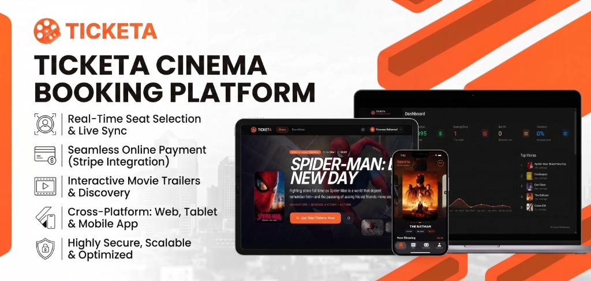

<div align="center">

  

  <br/><br/>

  [](https://dotnet.microsoft.com)
  [](https://dotnet.microsoft.com/apps/aspnet)
  [](https://react.dev)
  [](https://www.typescriptlang.org)
  [](https://flutter.dev)
  [](https://dart.dev)
  [](https://www.microsoft.com/sql-server)
  [](https://stripe.com)
  [](#-architecture--repository-structure)

  <p align="center">
    <b>An enterprise-grade, omnichannel Cinema Booking & Movie Ticketing Platform monorepo. Engineered with a robust .NET 8 Clean Architecture backend (API & MVC Backoffice), an ultra-responsive React 18 web client, and a high-performance Flutter mobile application for iOS & Android.</b>
  </p>

  <p align="center">
    <a href="#-core-platform-features">Key Features</a> •
    <a href="#-architecture--repository-structure">Architecture</a> •
    <a href="#-subsystems--applications">Subsystems</a> •
    <a href="#-technology-stack">Tech Stack</a> •
    <a href="#-quick-start--installation">Quick Start</a> •
    <a href="#-documentation">Documentation</a>
  </p>

</div>

---

## 🌟 Core Platform Features

- **🎯 Real-Time Seat Selection & Live Sync**: Interactive visual hall maps with instant seat hold, locking, and conflict-free multi-user synchronization.
- **💳 Seamless Online Payment (Stripe Integration)**: Enterprise-grade checkout supporting credit/debit cards, 3D Secure verification, and automated webhook handling.
- **🎬 Interactive Movie Trailers & Discovery**: Rich media catalog powered by TMDB integration, genre filtering, search, and embedded high-definition trailer playback.
- **📱 Cross-Platform Omnichannel Experience**: Perfectly tailored experiences across Desktop Web, Tablets, iOS, and Android devices.
- **🎟️ Digital Smart QR Tickets**: Instant digital ticket generation with verified QR codes for seamless in-theater validation and access.
- **🔐 Enterprise Security & Performance**: JWT token rotation, Google OAuth 2.0, role-based access control (RBAC), and SQL Server concurrency optimization.

---

## 🏛️ Architecture & Repository Structure

Ticketa is organized as a modular, feature-oriented Monorepo:

```text
Ticketa/
├── assets/                       # Brand assets, banners, and diagrams
├── docs/                         # 📚 Centralized Technical Documentation
│   └── Modules/
│       ├── Server/               # Backend architecture, database, API & feature docs
│       ├── Client/               # React web client documentation & components
│       └── Mobile/               # Flutter mobile documentation, BLoC & state flows
├── apps/
│   ├── server/                   # ⚙️ Backend Core (.NET 8 Clean Architecture)
│   │   ├── Ticketa.API/          # RESTful Web API controllers, JWT/OAuth, Middleware
│   │   ├── Ticketa.Web/          # Backoffice Admin & Management Portal (ASP.NET Core MVC)
│   │   ├── Ticketa.Core/         # Domain entities, DTOs, Repository & Service interfaces
│   │   ├── Ticketa.Infrastructure/ # EF Core Data Access, SQL Server, Stripe, TMDB
│   │   └── Ticketa.Tests/        # Unit & Integration test suites (xUnit & Moq)
│   │
│   ├── client/                   # 🌐 Customer Web Application (React 18 + TypeScript + Vite)
│   │   ├── src/
│   │   │   ├── components/       # Reusable UI components & interactive modals
│   │   │   ├── pages/            # Movies, Seat Selection, Checkout, My Tickets
│   │   │   ├── services/         # Axios API clients & Stripe integration
│   │   │   └── hooks/            # Custom React hooks & state management
│   │   └── package.json
│   │
│   └── mobile/                   # 📱 Cross-Platform Mobile Application (Flutter 3.x)
│       ├── lib/
│       │   ├── core/             # Theme engine, network interceptors, responsive utilities
│       │   └── features/         # Auth, Home, Movie Detail, Seat Selection, Payment, Tickets
│       └── pubspec.yaml
│
├── .github/                      # CI/CD pipelines & automated workflows
├── .gitignore                    # Monorepo-wide Git ignore rules (.NET, Node, Flutter)
├── .gitattributes                # Consistent line-ending normalizations
└── README.md                     # Root Monorepo Showcase
```

---

## 🚀 Subsystems & Applications

<table>
  <tr>
    <td width="33%" valign="top">
      <h3 align="center">⚙️ Backend Server</h3>
      <p align="center"><b>.NET 8 Web API + MVC</b></p>
      <ul>
        <li><b>Clean Architecture</b> with separation of concerns</li>
        <li><b>Entity Framework Core 8</b> + SQL Server migrations</li>
        <li><b>JWT Bearer</b> authentication & <b>Google OAuth 2.0</b></li>
        <li><b>Stripe</b> payment processing & webhooks</li>
        <li><b>TMDB API</b> synchronization for live cinema metadata</li>
        <li><b>Admin Portal (MVC)</b> for halls, movies, and reports</li>
      </ul>
    </td>
    <td width="33%" valign="top">
      <h3 align="center">🌐 Web Client</h3>
      <p align="center"><b>React 18 + TypeScript</b></p>
      <ul>
        <li>Modern, lightning-fast <b>Vite</b> tooling</li>
        <li>Fully responsive <b>Tailwind CSS</b> design</li>
        <li>Interactive hall layout & real-time seat picking</li>
        <li>Direct <b>Stripe Checkout</b> integration</li>
        <li>Trailer video modals & movie search discovery</li>
        <li>Customer profile & booking history management</li>
      </ul>
    </td>
    <td width="33%" valign="top">
      <h3 align="center">📱 Mobile App</h3>
      <p align="center"><b>Flutter 3.x (iOS & Android)</b></p>
      <ul>
        <li><b>BLoC / Cubit</b> state management architecture</li>
        <li>Full <b>Bilingual Support</b> (Arabic RTL & English LTR)</li>
        <li>Dynamic theme engine (Light, Dark & AMOLED)</li>
        <li><b>Google Sign-In</b> & Biometric authentication</li>
        <li>Native <b>Stripe Mobile PaymentSheet</b></li>
        <li>Offline QR code tickets & wallet storage</li>
      </ul>
    </td>
  </tr>
</table>

---

## 🛠️ Technology Stack

| Domain | Technologies & Libraries |
| :--- | :--- |
| **Backend** | C# 12, .NET 8, ASP.NET Core Web API, ASP.NET Core MVC, Entity Framework Core 8, SQL Server |
| **Integrations** | Stripe.net (3D Secure Payments), The Movie Database (TMDB API), SendGrid / SMTP MailKit |
| **Frontend Web** | React 18, TypeScript, Vite, Tailwind CSS, Axios, Lucide React, React Router |
| **Mobile App** | Flutter 3.x, Dart 3.x, flutter_bloc / cubit, Dio, flutter_stripe, google_sign_in, qr_flutter |
| **Testing** | xUnit, Moq, FluentAssertions, Flutter Test & Widget Testing |
| **DevOps & Tooling** | Git Monorepo, GitHub Actions, Visual Studio, VS Code, Android Studio |

---

## ⚡ Quick Start & Installation

### Prerequisites
- [.NET 8.0 SDK](https://dotnet.microsoft.com/download/dotnet/8.0)
- [Node.js (v18+)](https://nodejs.org/) & [npm](https://www.npmjs.com/)
- [Flutter SDK (3.x)](https://docs.flutter.dev/get-started/install)
- [SQL Server](https://www.microsoft.com/sql-server) (LocalDB / Express / Docker)

---

### 1. ⚙️ Running the Server (Backend)

```bash
cd apps/server

# Restore dependencies & build solution
dotnet restore
dotnet build

# Apply database migrations & start API
cd Ticketa.API
dotnet ef database update
dotnet run
```
*API will run on `https://localhost:7001` (or configured port) with Swagger available.*

---

### 2. 🌐 Running the Web Client (React)

```bash
cd apps/client

# Install npm dependencies
npm install

# Start local development server
npm run dev
```
*Web application will be accessible at `http://localhost:5173`.*

---

### 3. 📱 Running the Mobile App (Flutter)

```bash
cd apps/mobile

# Get Flutter packages
flutter pub get

# Run on connected device / emulator
flutter run
```

---

## 📚 Documentation

Detailed technical documents, database diagrams, API specifications, and architectural decision records (ADRs) are maintained in the central [`docs/`](./docs) directory:

- 🏛️ [Architecture Overview](./docs/Modules/Server/architecture.md)
- 🔐 [Authentication & Security](./docs/Modules/Server/authentication.md)
- 🗄️ [Database Schema & Entities](./docs/Modules/Server/database.md)
- 🧪 [Testing Strategy & Test Plan](./docs/Modules/Server/testing-plan.md)
- 📐 [Architectural Decisions (ADRs)](./docs/Modules/Server/decisions/)
- 🎟️ [Feature Blueprints (Booking, Payments, Showtimes)](./docs/Modules/Server/features/)

---

## 🌿 Git Branching & Workflow

- **`development`**: Active integration branch where all subsystem PRs and feature merges land.
- **`main`**: Production-ready releases and tagged deployment milestones.
- **`feature/<subsystem>-<feature-name>`**: Granular feature branches (e.g. `feature/mobile-seat-picker`, `feature/server-stripe-webhook`).

---

<div align="center">
  <p>Made with ❤️ by <b>Mohamed Gasser</b> & <b>Moamen Fathy</b></p>
  <p>© 2026 Ticketa. All Rights Reserved.</p>
</div>
