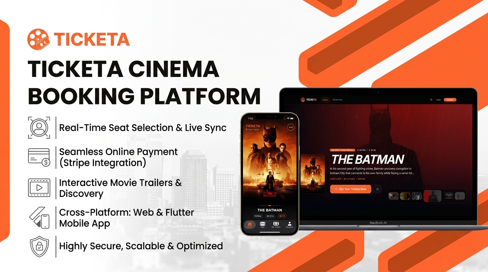

# 🎬 Ticketa — Smart Cinema Booking & Management Platform

<p align="center">
  
</p>

---

## 🌟 Key Features

- 🎟️ **Real-Time Seat Selection**: Live interactive cinema hall map with real-time seat reservation.
- 💳 **Seamless Online Payments**: Integrated with **Stripe** for fast, secure checkout.
- 🎬 **Movie Discovery & Trailers**: High-definition movie trailers, dynamic synopsis, and cast lists.
- 📱 **Cross-Platform Experience**: Built with **Flutter** (iOS & Android) with responsive tablet support and Web Client.
- 🛡️ **Clean Architecture & High Performance**: BLoC/Cubit state management, memory-optimized image caching, and strict error handling.

---

## 🚀 Getting Started

### Prerequisites
- [Flutter SDK](https://docs.flutter.dev/get-started/install) (3.x or newer)
- Dart SDK

### Installation
```bash
# Clone the repository
git clone https://github.com/MohamedGasser15/Ticketa-mobile.git

# Navigate to Flutter project
cd "Ticketa Flutter"

# Get dependencies
flutter pub get

# Run the app
flutter run
```

