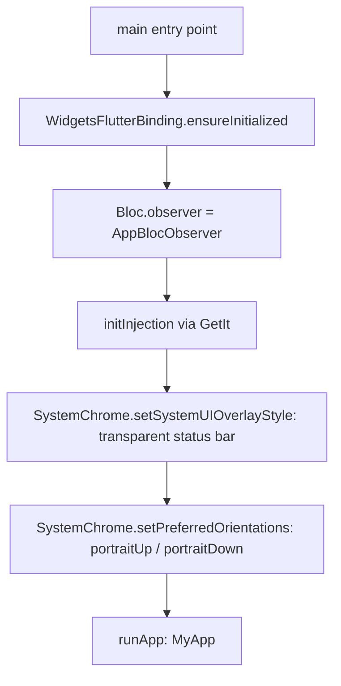
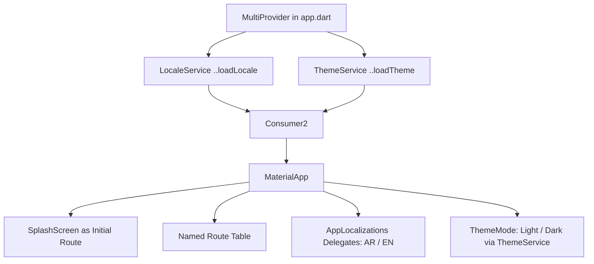
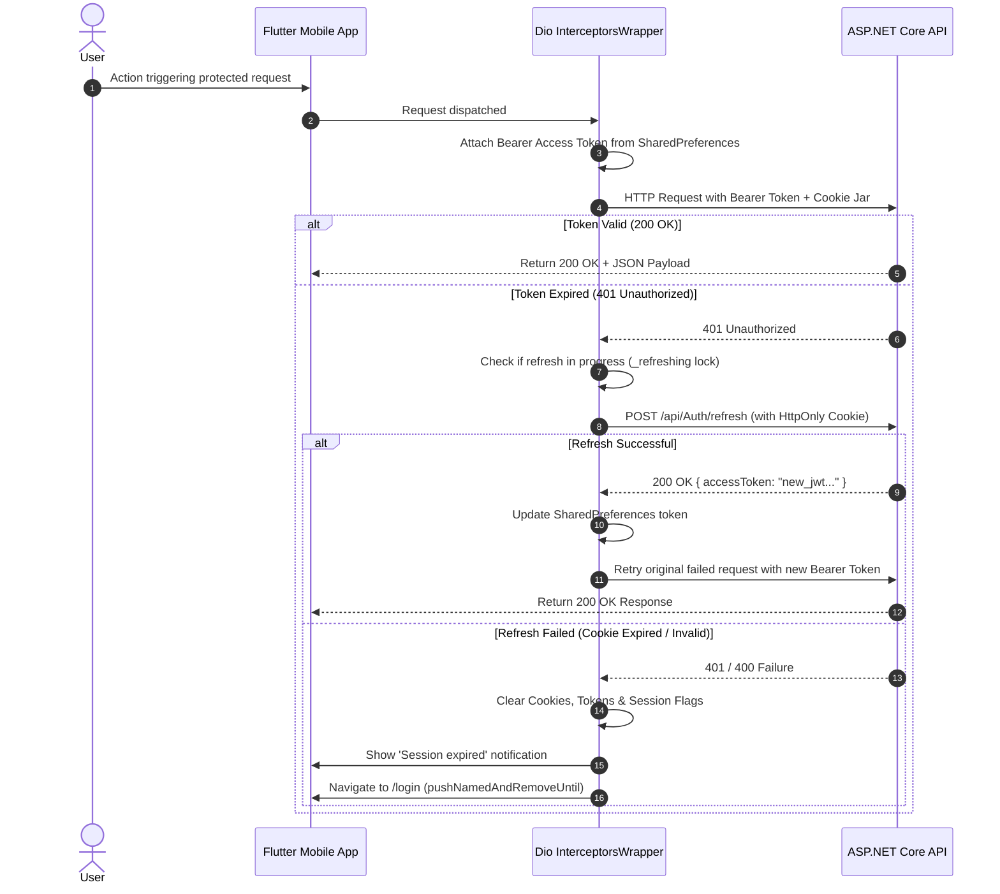
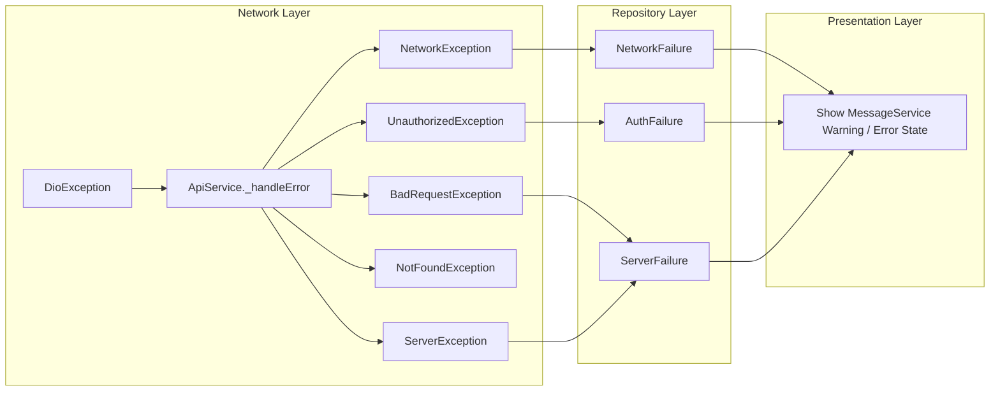

# Mobile Architecture & Engineering Guide (Flutter)

---

## 1. Overview & Vision

### Purpose
This document provides the definitive engineering and architectural specification for the **Ticketa Mobile Application** (`apps/mobile`), a high-performance cinema ticketing and movie discovery mobile client built with Flutter and targeting iOS and Android platforms powered by Dart SDK `^3.11.5`.

### Core Architectural Philosophy
The application adheres strictly to **Feature-First Clean Architecture** with unidirectional data flow and reactive BLoC/Cubit state management:

```
┌─────────────────────────────────────────────────────────────────────────┐
│                           PRESENTATION LAYER                            │
│   Screens / Pages (UI)  ◄───►  Widgets  ◄───►  Cubits / Blocs (State)   │
└────────────────────────────────────┬────────────────────────────────────┘
                                     │ (Calls repository methods)
                                     ▼
┌─────────────────────────────────────────────────────────────────────────┐
│                              DOMAIN / DATA                              │
│   Repositories (Data Orchestration & Error Mapping)                     │
│   Models / DTOs (Defensive Deserialization & Typed Schemas)             │
└────────────────────────────────────┬────────────────────────────────────┘
                                     │ (Executes HTTP requests)
                                     ▼
┌─────────────────────────────────────────────────────────────────────────┐
│                               CORE LAYER                                │
│   ApiService (Dio HTTP Client + Cookies + 401 Auto-Refresh)             │
│   Services (Navigation, Theme, Locale, Message, GoogleAuth)             │
│   Design System & Theme (AppColors, AppTheme, AppResponsive)            │
│   Dependency Injection (GetIt Service Locator)                          │
└─────────────────────────────────────────────────────────────────────────┘
```

1. **Presentation Layer:** Declarative UI widgets, responsive page layouts, and `Cubit`/`Bloc` state controllers that emit immutable state objects.
2. **Data Layer:** DTOs and aggregate domain models with defensive JSON parsing, and abstract/concrete repositories orchestrating network calls and mapping exceptions to typed `Failure` objects.
3. **Core Layer:** Cross-cutting infrastructure including singleton `Dio` network client, `PersistCookieJar` for HttpOnly refresh tokens, `GetIt` dependency injection, centralized navigation, and global error handling.

---

## 2. Technology Stack & Dependencies

| Category | Package | Version | Architectural Responsibility |
|---|---|---|---|
| **Core Framework** | `flutter` | SDK | Cross-platform UI runtime & Material 3 design system |
| **State Management** | `flutter_bloc` | `^8.1.6` | Event/action-driven reactive state management via `Cubit` and `Bloc` |
| | `provider` | `^6.1.5+1` | Root-level infrastructure services (`LocaleService`, `ThemeService`) |
| **Dependency Injection** | `get_it` | `^7.6.7` | Service locator for singleton repositories, network clients, and factory cubits |
| **Networking & HTTP** | `dio` | `^5.4.3` | High-throughput HTTP client with interceptors, timeouts, and custom logger |
| | `dio_cookie_manager`| `^3.5.0` | Cookie management integration with Dio engine |
| | `cookie_jar` | `^4.0.9` | Persistent disk-backed cookie storage for `refreshToken` |
| **Payments** | `flutter_stripe` | `^14.0.0` | Native Stripe Payment Sheet SDK & 3D Secure verification |
| **Authentication** | `google_sign_in` | `^6.3.0` | Native Google OAuth SDK for mobile ID token exchange |
| **Local Storage** | `shared_preferences`| `^2.2.2` | Persistent key-value storage for access tokens, guest flags, and preferences |
| | `path_provider` | `^2.1.6` | Filesystem paths for cookie storage and app cache |
| **Video & Media** | `youtube_player_iframe`| `^6.0.0` | In-app YouTube trailer playback with modal and fullscreen players |
| | `cached_network_image`| `^3.4.1` | Remote movie poster disk caching, memory deduplication, and fade-in transitions |
| | `shimmer` | `^3.0.0` | Skeleton gradient shimmer loading animations |
| **Ticketing & QR** | `qr_flutter` | `^4.1.0` | Dynamic vector QR code generation for digital cinema entry validation |
| **Navigation & UI** | `google_nav_bar` | `^5.0.6` | Animated floating bottom navigation bar |
| | `cupertino_icons` | `^1.0.8` | Cupertino and iOS native iconography |
| | `url_launcher` | `^6.3.1` | Deep-linking and external URL redirection |
| **Localization** | `flutter_localizations`| SDK | Arabic (RTL) and English (LTR) bidirectional layout mirroring |
| | `intl` | `^0.20.2` | Date/time, currency, and number formatting |

---

## 3. Application Bootstrap & Lifecycle (`main.dart`)



### Bootstrap Sequence (`main.dart:8-26`)
1. **Engine Binding:** `WidgetsFlutterBinding.ensureInitialized()` attaches the Flutter rendering pipeline before asynchronous initialization begins.
2. **Global BLoC Observer:** `Bloc.observer = AppBlocObserver()` hooks into state transitions, event dispatches, and errors across all Cubits for real-time debugging.
3. **Dependency Injection Setup:** `initInjection()` initializes SharedPreferences, `PersistCookieJar`, `Dio`, network interceptors, repositories, and Cubits.
4. **System Chrome:** Sets transparent status bar with light icon brightness and constrains device orientation to portrait modes.
5. **App Inception:** Launches `MyApp` root widget with nested `MultiProvider`.

---

## 4. Root State Tree & Theme Provider (`app.dart`)

`MyApp` configures root-level services using `MultiProvider` and `Consumer2<LocaleService, ThemeService>`:



### Key Architectural Behaviors
- **Eager Initialization (`..loadLocale()` & `..loadTheme()`):** Persistent preferences are loaded before first frame to avoid layout or theme flashes.
- **Global Navigation Key:** `navigatorKey: getIt<NavigationService>().navigatorKey` enables context-less navigation, crucial for 401 session expiry redirects from HTTP interceptors.
- **Dual Localization Delegates:** Configured for `en` (English) and `ar` (Arabic) with full RTL text directionality handling.

---

## 5. Security & Authentication Architecture

### Dual-Token Lifecycle (Bearer JWT + HttpOnly Cookie)
The mobile app communicates with the ASP.NET Core API using an advanced dual-token architecture:
1. **Short-Lived Access Token (JWT):** Stored in `SharedPreferences` and injected via `Authorization: Bearer <token>` header on every request.
2. **Long-Lived Refresh Token:** Maintained inside an `HttpOnly` secure cookie handled automatically by `PersistCookieJar` and `DioCookieManager`.



---

## 6. Error Handling Hierarchy

The mobile client enforces strict layered exception-to-failure translation:



### Core Failures Catalog (`core/errors/failures.dart`)
- **`ServerFailure`:** Server returned 4xx or 5xx with localized validation or business error message.
- **`NetworkFailure`:** No internet connection or request timeout.
- **`AuthFailure`:** Authentication credentials invalid or session terminated.

---

## 7. Responsive Design System (`app_responsive.dart`)

The app dynamically calculates scaling factors and layouts based on screen dimensions:
- **Breakpoint Detection:** `isMobile`, `isTablet`, `isDesktop` utilities.
- **Proportional Scaling:** `AppResponsive.w(context, percent)`, `AppResponsive.h(context, percent)`.
- **Dynamic Grid Columns:** Calculates optimal seat grid columns and movie card aspects across phones and foldable screens.

---

## 8. Directory Organization (`apps/mobile/lib/`)

```
lib/
├── app.dart                          # Root MaterialApp & MultiProvider setup
├── main.dart                         # Application entrypoint & system bootstrap
├── core/
│   ├── constants/                    # ApiConstants, AppConstants
│   ├── di/                           # Dependency injection (injection.dart)
│   ├── errors/                       # Exceptions and Failure classes
│   ├── network/                      # ApiService (Dio wrapper)
│   ├── services/                     # Locale, Theme, Navigation, Message services
│   ├── theme/                        # AppColors, AppTheme
│   ├── utils/                        # AppLogger, AppBlocObserver, AppResponsive, YouTubeUtils
│   └── widgets/                      # Shared reusable UI widgets (GlassCard, AppShimmer, etc.)
├── features/
│   ├── auth/                         # Authentication, login, register, password reset
│   ├── booking/                      # Cinema seat grid, showtimes, reservation cubits
│   ├── home/                         # Discovery feed, hero carousel, movie details, trailers
│   ├── main/                         # Main navigation host with GoogleNavBar
│   ├── now_showing/                  # Currently screening movies catalog
│   ├── payment/                      # Stripe Payment Sheet, order summary, booking confirmation
│   ├── settings/                     # User profile, tickets history, theme & language settings
│   └── splash/                       # Animated splash screen & session verification
└── l10n/                             # ARB localization files & generated delegates
```
