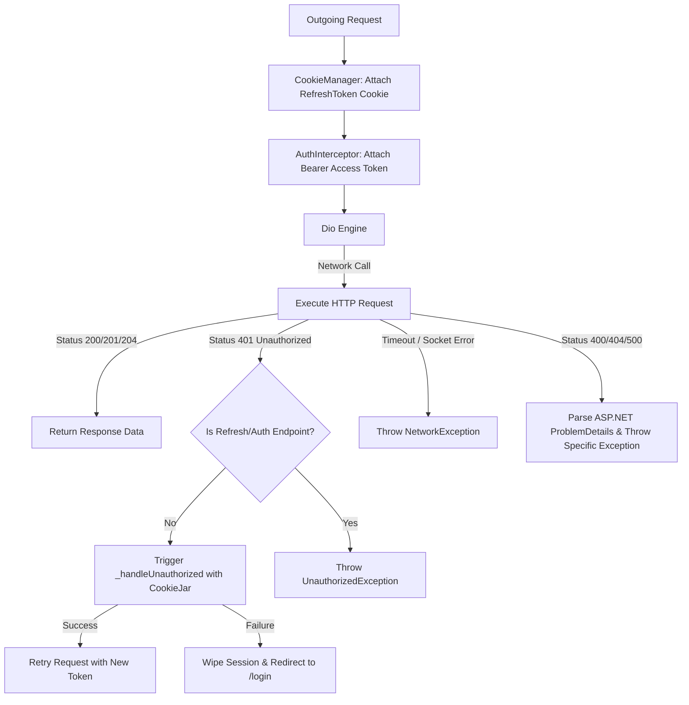
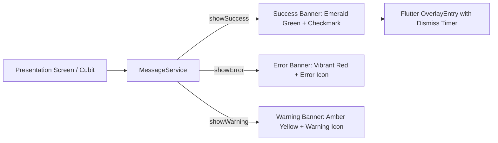

# Mobile Core Services Architecture & Reference

> **Directory:** `apps/mobile/lib/core/services/` & `apps/mobile/lib/core/network/`  
> **Target Framework:** Flutter 3.x / Dart 3.11  
> **Key Dependencies:** `dio: ^5.4.3`, `dio_cookie_manager: ^3.5.0`, `cookie_jar: ^4.0.9`, `shared_preferences: ^2.2.2`, `google_sign_in: ^6.3.0`, `flutter_stripe: ^14.0.0`, `youtube_player_iframe: ^6.0.0`

This document provides a comprehensive technical reference for the core infrastructure and background services supporting the Ticketa Flutter mobile client.

---

## 1. Network Layer: `ApiService` & Interceptor Pipeline

**Files:** `apps/mobile/lib/core/network/api_service.dart` & `apps/mobile/lib/core/di/injection.dart`

`ApiService` wraps `dio.Dio` to provide centralized HTTP methods with automated error parsing, token injection, and transparent token refreshing.



### 1.1 Architectural Specifications
- **Base URL:** Defined in `ApiConstants.baseUrl` (`https://ticketa.runasp.net/api/`).
- **Timeouts:** `connectTimeout: 15s`, `receiveTimeout: 20s`, `sendTimeout: 20s`.
- **Default Headers:** `Content-Type: application/json`, `Accept: application/json`.
- **Cookie Persistence:** `PersistCookieJar` stored in application support directory (`${supportDir.path}/cookies`), persisting the ASP.NET Core `refreshToken` HttpOnly cookie across app reboots.

### 1.2 Method Catalog
| Method | Signature | Description |
| :--- | :--- | :--- |
| `get` | `Future<Response> get(String path, {Map<String, dynamic>? queryParameters, Options? options})` | Executes HTTP GET with query parameters and headers. |
| `post` | `Future<Response> post(String path, {dynamic data, Map<String, dynamic>? queryParameters, Options? options})` | Executes HTTP POST with JSON body payload. |
| `put` | `Future<Response> put(String path, {dynamic data, Map<String, dynamic>? queryParameters, Options? options})` | Executes HTTP PUT for resource updates. |

### 1.3 Error Mapping & ASP.NET Validation Parsing
`ApiService._handleError(DioException e)` inspects HTTP responses and maps error payloads (including ASP.NET Core `ValidationProblemDetails` and custom `message` / `errors` arrays) into typed exceptions:
- **`NetworkException`**: Triggers on timeout or connection failure.
- **`UnauthorizedException`**: HTTP 401.
- **`ForbiddenException`**: HTTP 403.
- **`NotFoundException`**: HTTP 404.
- **`BadRequestException`**: HTTP 400 with aggregated field validation error strings.
- **`ServerException`**: HTTP 500+ or unexpected status codes.

---

## 2. Navigation Service: `NavigationService`

**File:** `apps/mobile/lib/core/services/navigation_service.dart`

`NavigationService` maintains a decoupled `GlobalKey<NavigatorState>` registered as a singleton in `GetIt`.

### 2.1 Core Capabilities
1. **Context-Free Navigation:** Allows background layers (such as network interceptors on 401 token expiry) to execute navigation commands without a UI `BuildContext`.
2. **Session Reset Navigation:**
   ```dart
   void pushNamedAndRemoveUntil(String routeName) {
     navigatorKey.currentState?.pushNamedAndRemoveUntil(
       routeName,
       (route) => false,
     );
   }
   ```

---

## 3. UI Messaging Service: `MessageService`

**File:** `apps/mobile/lib/core/services/message_service.dart`

`MessageService` renders custom animated floating notification banners using Flutter `Overlay` with slide-and-fade physics.



### 3.1 Method Catalog
| Method | Parameters | Visual Styling |
| :--- | :--- | :--- |
| `showSuccess` | `context, message` | `AppColors.success` (`#10B981`) background, `Icons.check_circle_outline_rounded` |
| `showError` | `context, message` | `AppColors.error` (`#EF4444`) background, `Icons.error_outline_rounded` |
| `showWarning` | `context, message` | `AppColors.warning` (`#F59E0B`) background, `Icons.warning_amber_rounded` |

---

## 4. Localization Controller: `LocaleService`

**File:** `apps/mobile/lib/core/services/locale_service.dart`

`LocaleService` is a `ChangeNotifier` that manages dynamic language switching between **English (`en`)** and **Arabic (`ar`)**.

### 4.1 State & Persistence
- **Default Locale:** English (`Locale('en')`).
- **Storage Key:** `AppConstants.languageKey` (`'app_language'`) in `SharedPreferences`.
- **Eager Loading:** Loaded at startup via `..loadLocale()` in `app.dart`.
- **Runtime Mutation:** `setLocale(Locale)` updates reactive listeners and immediately persists the selection to disk.

---

## 5. Theme Controller: `ThemeService`

**File:** `apps/mobile/lib/core/services/theme_service.dart`

`ThemeService` is a `ChangeNotifier` controlling dynamic switching between **Dark Theme (Default Cinema Mode)** and **Light Theme**.

### 5.1 State & Persistence
- **Default Mode:** `ThemeMode.dark`.
- **Storage Key:** `AppConstants.themeKey` (`'app_theme'`) in `SharedPreferences`.
- **Helper Getters:** `isDarkMode` returns `true` when active theme is dark.
- **Runtime Mutation:** `setTheme(ThemeMode)` triggers instant UI re-render and writes `'dark'` or `'light'` to disk.

---

## 6. Social Authentication: `GoogleAuthService`

**File:** `apps/mobile/lib/features/auth/data/google_auth_service.dart`

Integrates the native `GoogleSignIn` SDK to authenticate users and extract the OAuth `idToken` for exchange with the backend `/api/Auth/google` endpoint.

### 6.1 Authentication Flow
1. Triggers `GoogleSignIn.signIn()` native account picker.
2. Retrieves `GoogleSignInAuthentication` containing `idToken` and `accessToken`.
3. Passes `idToken` to `AuthRepository.loginWithGoogle(idToken)`.
4. Backend verifies Google token and issues Ticketa JWT and session cookies.

---

## 7. Media & Video Utilities: `YouTubeUtils`

**File:** `apps/mobile/lib/core/utils/youtube_utils.dart`

Provides utility functions to parse YouTube video IDs and launch trailers:
- `extractVideoId(String url)`: Regex parser extracting YouTube IDs from standard watch URLs, short URLs (`youtu.be`), and embed URLs.
- `showTrailerModal(BuildContext context, String youtubeUrl)`: Opens a glassmorphism bottom sheet embedding `YoutubePlayer` for inline trailer preview without leaving the screen.
- `openFullscreenTrailer(BuildContext context, String youtubeUrl)`: Pushes a dedicated landscape-optimized fullscreen video player screen.

---

## 8. Logging & Observability

### 8.1 `AppLogger` (`core/utils/app_logger.dart`)
Structured console logging with log levels:
- `AppLogger.d(message, tag)`: Debug messages (active in `kDebugMode`).
- `AppLogger.i(message, tag)`: Informational breadcrumbs.
- `AppLogger.w(message, tag)`: Non-fatal warnings.
- `AppLogger.e(message, error, stackTrace, tag)`: Fatal exceptions.

### 8.2 `AppBlocObserver` (`core/utils/app_bloc_observer.dart`)
Global BLoC observer monitoring all Cubits in debug mode:
- `onChange`: Logs previous state ➡️ next state transitions.
- `onError`: Captures unhandled Cubit exceptions with stack traces.
