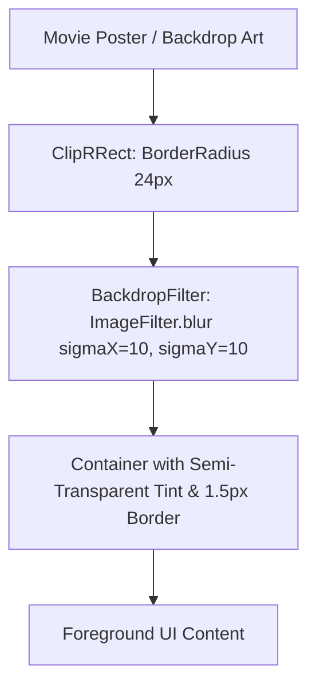

# Mobile Design System & UI Specifications

> **Source Files:** `apps/mobile/lib/core/theme/app_colors.dart`, `apps/mobile/lib/core/theme/app_theme.dart`, `apps/mobile/lib/core/widgets/glass_card.dart`  
> **Aesthetic Archetype:** Modern Cinema Dark, Frosted Glassmorphism, Warm Ember Accents (`#F2612B`)

---

## 1. Color Palette & Semantic Tokens

### 1.1 Brand & Accent Tokens

| Color Name | Hex Code | Visual Sample | Usage & Role |
| :--- | :--- | :--- | :--- |
| **Warm Orange** | `#F2612B` | `rgb(242, 97, 43)` | Primary brand color, CTA buttons, active tab indicators, selected cinema seats. |
| **Lighter Orange** | `#FF7F50` | `rgb(255, 127, 80)` | Accent highlight, hover effects, secondary gradient stops. |
| **Terracotta** | `#C15637` | `rgb(193, 86, 55)` | Secondary accents, subtle badges. |

### 1.2 Dark Mode Surfaces (Default Cinema Aesthetic)

| Surface Token | Hex Code | Visual Value | Usage |
| :--- | :--- | :--- | :--- |
| **Background Dark** | `#000000` | Pure Black | Root scaffold background, maximizing OLED contrast & battery efficiency. |
| **Surface Dark** | `#121212` | Elevated Black | Card containers, bottom sheets, navigation bar containers. |
| **Medium Grey** | `#1E1E1E` | Mid Grey | Input text fields, unselected seat icons. |
| **Text Primary Dark**| `#FFFFFF` | Pure White | Headlines, movie titles, high-contrast labels. |
| **Text Secondary Dark**|`#B0B0B0` | Muted Silver | Subtitles, genres, movie runtime, synopsis paragraphs. |

### 1.3 Light Mode Surfaces

| Surface Token | Hex Code | Usage |
| :--- | :--- | :--- |
| **Background Light** | `#F8F9FA` | Clean off-white background. |
| **Surface Light** | `#FFFFFF` | Pure white cards with subtle drop shadows. |
| **Text Primary Light** | `#1A1A1A` | Charcoal black high-contrast text. |
| **Text Secondary Light**|`#757575` | Neutral grey for metadata. |

### 1.4 Status & Feedback Tokens

| Status | Hex Code | Semantic Role |
| :--- | :--- | :--- |
| **Success** | `#4CAF50` / `#10B981` | Successful booking confirmation, confirmed payment banner. |
| **Error** | `#D32F2F` / `#EF4444` | Form validation failures, bank decline warnings. |
| **Warning** | `#FFA000` / `#F59E0B` | Seat conflict warning, max selection limits, cancellation notices. |

---

## 2. Typography System

The typography engine dynamically balances Latin and Arabic scripts across both platforms:

```
Headlines        TextStyle(fontWeight: FontWeight.w900, letterSpacing: 1.2)
Titles           TextStyle(fontWeight: FontWeight.bold, fontSize: 18)
Body Text        TextStyle(fontSize: 14, height: 1.5, color: textSecondary)
Captions & Tags  TextStyle(fontSize: 12, fontWeight: FontWeight.w600)
```

- **Arabic Typography:** Inherits system Arabic / Cairo fonts with optimized line heights to prevent descender clipping.
- **Latin Typography:** Clean Material 3 sans-serif geometry with bold weights on movie headlines.

---

## 3. Glassmorphism & Shaders Engine (`GlassCard`)

Ticketa utilizes real-time Gaussian frosted glassmorphism:



- **Blur Strength:** Default `sigmaX = 10.0`, `sigmaY = 10.0`.
- **Border Spec:** `Border.all(color: Colors.white.withOpacity(0.12), width: 1.5)`.

---

## 4. Spacing & Elevation Guidelines

- **Base Grid Unit:** 8px increments (`8`, `16`, `24`, `32`, `48`).
- **Corner Radii:**
  - Movie Posters: `16px`
  - Cards & Glass Containers: `24px`
  - Buttons & Navigation Bar: `30px` (Pill shape)
  - Chips & Badges: `20px`
