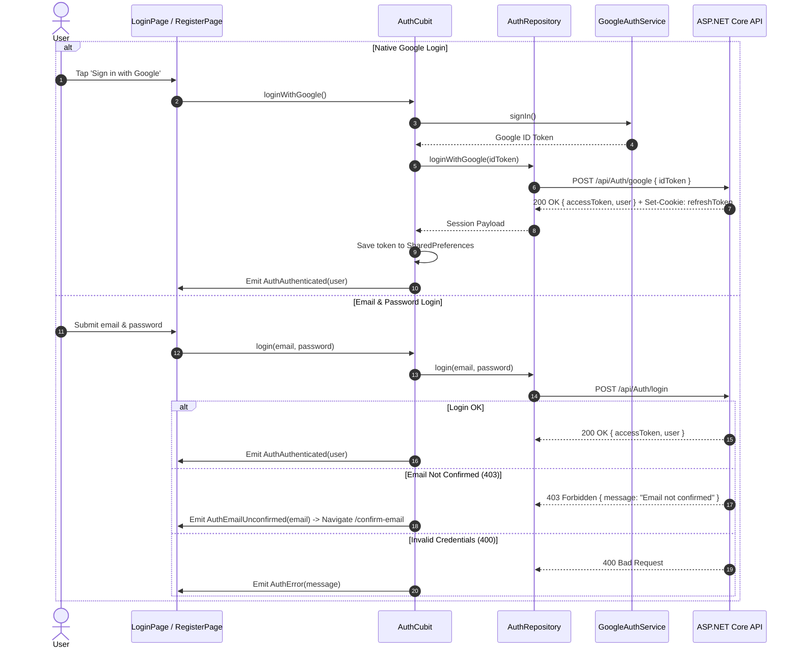

# Feature Deep-Dive: Authentication & Identity

> **Module Path:** `apps/mobile/lib/features/auth/`  
> **Key Files:** `auth_repository.dart`, `google_auth_service.dart`, `auth_cubit.dart`, `auth_state.dart`, `login_page.dart`, `register_page.dart`, `confirm_email_page.dart`, `forgot_password_page.dart`

---

## 1. Feature Overview

The Authentication module delivers secure user onboarding, authentication, and session continuity. It supports:
1. **Email & Password Authentication:** Standard login and signup with client-side form validation.
2. **Email Verification Flow:** 6-digit OTP code verification required before full account activation.
3. **Password Recovery:** Forgot password email flow with reset token dispatch.
4. **Social Authentication:** Native Google Sign-In with backend token exchange.
5. **Guest Browsing:** Allows unauthenticated users to explore movie catalogs and showtimes with deferred authentication prompted during seat checkout.

---

## 2. Authentication Flow & State Lifecycle

---

## 3. Screen Inventory

| Screen | File Location | Route | Purpose |
| :--- | :--- | :--- | :--- |
| **Login** | `features/auth/presentation/screens/login_page.dart` | `'/login'` | Credentials input, Google sign-in button, guest access option. |
| **Register** | `features/auth/presentation/screens/register_page.dart` | `'/register'` | Name, date of birth picker, email, and password registration form. |
| **Confirm Email** | `features/auth/presentation/screens/confirm_email_page.dart` | `'/confirm-email'` | 6-digit OTP code entry with resend cooldown timer. |
| **Forgot Password** | `features/auth/presentation/screens/forgot_password_page.dart` | `'/forgot-password'`| Password recovery request entrypoint. |

---

## 4. Error Handling & Form Validations
- **Email Regex:** Validates standard RFC 5322 email patterns.
- **Password Strength:** Enforces minimum 8 characters, numbers, and uppercase/lowercase rules.
- **Date of Birth:** Verifies minimum age requirements for cinema ticketing.
- **Server Validation Catching:** Unpacks ASP.NET Identity error strings and presents floating warnings via `MessageService.showError`.
