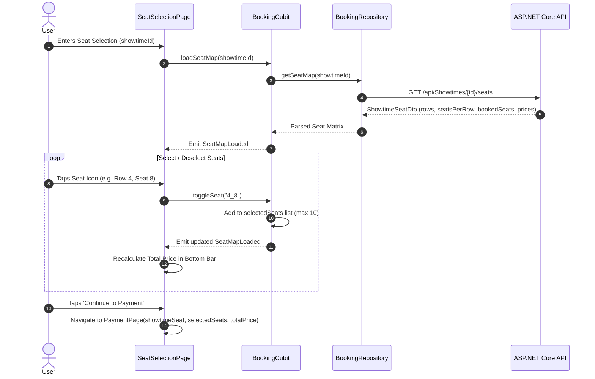

# Feature Deep-Dive: Cinema Seat Selection & Booking

> **Module Path:** `apps/mobile/lib/features/booking/`  
> **Key Files:** `booking_cubit.dart`, `booking_state.dart`, `booking_repository.dart`, `seat_selection_page.dart`, `cinema_seat_grid.dart`, `cinema_screen_painter.dart`, `seat_selection_bottom_bar.dart`

---

## 1. Feature Overview

The **Seat Selection & Booking** engine is the core transactional feature of Ticketa:
1. **Interactive Cinema Seating Matrix:** Real-time visual representation of cinema auditorium rows and columns.
2. **Hall Type Visual Customization:** Custom vector-drawn curved projection screen adapting to **IMAX**, **Standard**, and **VIP / Gold** hall configurations.
3. **Multi-Tier Seat Pricing:** Different seat rows (Standard, Premium, VIP Lounge) dynamically priced from the backend `categoryPrices` schema.
4. **Interactive State Transitions:** Real-time toggle of seat coordinates (`row_seatNumber`), tracking selection limits (max 10 seats per order).
5. **Real-Time Conflict Detection:** Detects concurrency conflicts if another customer reserves a seat before order completion, alerting the user to re-select.

---

## 2. Seat Selection Architecture & Data Flow

---

## 3. Visual Hall Rendering Engine

### 3.1 `CinemaScreenPainter`
Renders an ambient cinema environment:
- **Curved Projection Arc:** Smooth Bézier curve simulating a giant panoramic cinema screen.
- **Dynamic Projection Light Cone:** Soft downward gradient mimicking projector beam illumination falling across the front rows.

### 3.2 `CinemaSeatGrid`
- **Dynamic Calculation:** Automatically calculates seat size and padding based on available viewport width and `seatsPerRow`.
- **Row Alphabetic Markers:** Renders row identifiers (`A`, `B`, `C`...) on both left and right margins.
- **Seat States:**
  - **Available:** Subtle rounded outline.
  - **Selected:** Vibrant Warm Orange (`#F2612B`) with checkmark indicator and scale bump.
  - **Booked / Occupied:** Dark greyed-out icon with disabled pointer events.
  - **VIP / Lounge:** Premium gold/amber color accent.
