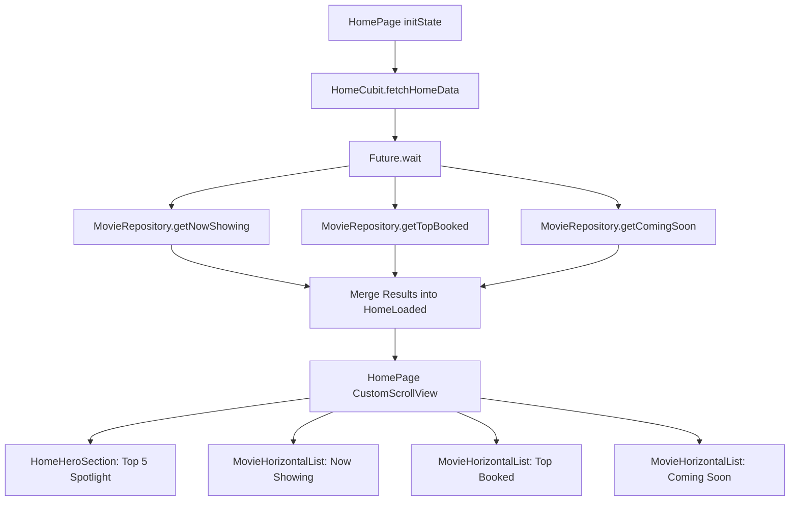

# Feature Deep-Dive: Home & Discovery

> **Module Path:** `apps/mobile/lib/features/home/`  
> **Key Files:** `home_cubit.dart`, `home_state.dart`, `home_page.dart`, `movie_repository.dart`, `home_hero_section.dart`, `movie_horizontal_list.dart`

---

## 1. Feature Overview

The **Home** module serves as the commercial discovery portal for Ticketa. It displays:
1. **Hero Spotlight Carousel:** Auto-scrolling top blockbuster films with high-res backdrops, trailer action buttons, and direct booking triggers.
2. **Now Showing Carousel:** Movies currently active in partner cinema theaters.
3. **Top Booked Section:** Box-office bestsellers and trending films.
4. **Coming Soon / Upcoming:** Anticipated future theatrical releases.
5. **Parallel Data Fetching:** Optimized with `Future.wait` for rapid first-contentful paint.

---

## 2. Architecture & Data Flow

---

## 3. UI Composition & Slivers

`HomePage` utilizes a performant `CustomScrollView` with custom slivers and pull-to-refresh:
- **`HomeHeader`:** App branding, personalized user greeting, avatar button triggering account tab switch.
- **`HomeHeroSection`:** Parallax `PageView` with smooth indicator pills.
- **`MovieHorizontalList`:** Horizontal `ListView.builder` rendering `SmallMovieCard` items with smooth poster loading and hero animations.
- **`See All` Triggers:** Each section's header button routes to `SeeAllMoviesPage` with the complete filtered list.
