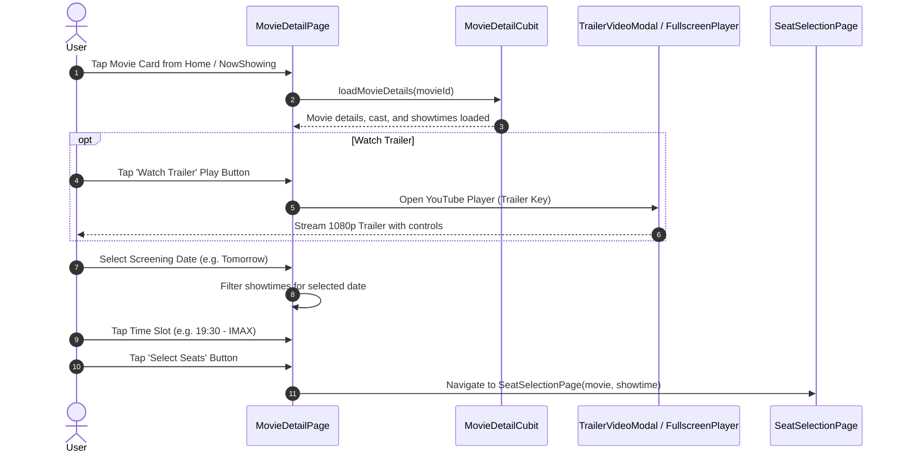

# Feature Deep-Dive: Movie Catalog & Media

> **Module Path:** `apps/mobile/lib/features/home/presentation/screens/` & `widgets/`  
> **Key Files:** `movie_detail_page.dart`, `movie_detail_cubit.dart`, `see_all_movies_page.dart`, `see_all_cast_page.dart`, `fullscreen_trailer_player.dart`, `trailer_video_modal.dart`

---

## 1. Feature Overview

The **Movie Catalog & Media** module provides an immersive multimedia breakdown of any movie:
1. **Dynamic Backdrop Header:** Collapsible sliver app bar with blurred backdrop poster, rating badge, and runtime tags.
2. **Interactive Date & Time Picker:** Direct showtime selection tied to available cinema auditoriums.
3. **Curated Cast & Crew:** Horizontal carousel of actors with profile photos and character names.
4. **Embedded YouTube Trailer:** In-app trailer playback modal and full-screen landscape video player.
5. **Direct Seat Booking Transition:** Initiates the cinema hall seat selection flow with selected date and time.

---

## 2. Screen & Media Lifecycle

---

## 3. Sub-Screens & Modals

| Screen / Component | File Location | Purpose |
| :--- | :--- | :--- |
| **Movie Detail Page** | `features/home/presentation/screens/movie_detail_page.dart` | Aggregate movie showcase with synopsis, cast, and date/time selector. |
| **See All Movies Page** | `features/home/presentation/screens/see_all_movies_page.dart` | 2-column grid of movies with search filtering. |
| **See All Cast Page** | `features/home/presentation/screens/see_all_cast_page.dart` | Full credited actors list with high-res headshots. |
| **Trailer Video Modal** | `features/home/presentation/widgets/trailer_video_modal.dart` | Bottom sheet player embedding `YoutubePlayerIFrame`. |
| **Fullscreen Trailer** | `features/home/presentation/widgets/fullscreen_trailer_player.dart` | Landscape player with orientation lock and custom playback HUD. |
