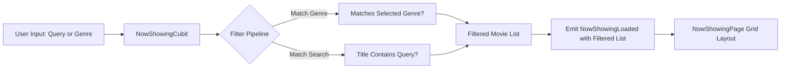

# Feature Deep-Dive: Now Showing

> **Module Path:** `apps/mobile/lib/features/now_showing/`  
> **Key Files:** `now_showing_cubit.dart`, `now_showing_state.dart`, `now_showing_page.dart`, `now_showing_card.dart`, `now_showing_skeleton.dart`

---

## 1. Feature Overview

The **Now Showing** module provides dedicated browsing for all movies currently playing in cinemas:
1. **Interactive Search:** Instant client-side search across movie titles and genres.
2. **Genre Chip Filters:** Horizontal scrollable category filters (All, Action, Comedy, Drama, Sci-Fi, Horror, Romance, Animation).
3. **Card Presentation:** Rich movie cards showing high-resolution poster, age rating, duration, genres, average star rating, and direct "Book" button.
4. **Pull-to-Refresh & Shimmer:** Smooth pull-to-refresh integration and skeleton placeholders during loading.

---

## 2. Filtering & Search Pipeline

---

## 3. UI Component Details

### `NowShowingCard` (`widgets/now_showing_card.dart`)
- **Poster Thumbnail:** `CachedNetworkImage` with rounded corners and subtle shadow.
- **Metadata Badges:** Star rating pill, duration chip (e.g. `142 min`), and hall types available (`IMAX`, `Standard`).
- **Quick Action:** "Book" button navigating immediately to `MovieDetailPage`.
