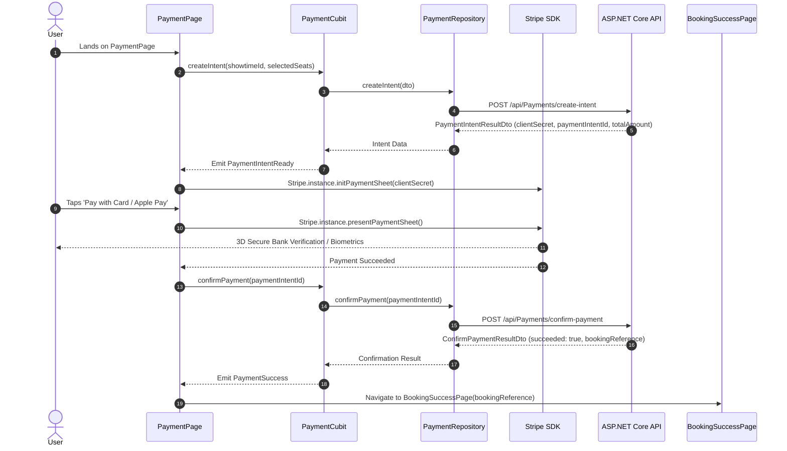

# Feature Deep-Dive: Payment & Checkout

> **Module Path:** `apps/mobile/lib/features/payment/`  
> **Key Files:** `payment_cubit.dart`, `payment_state.dart`, `payment_repository.dart`, `payment_page.dart`, `booking_success_page.dart`, `order_summary.dart`, `ticket_card.dart`  
> **Payment SDK:** `flutter_stripe: ^14.0.0`

---

## 1. Feature Overview

The **Payment & Checkout** module handles payment processing and ticket delivery:
1. **Stripe Native Payment Sheet:** In-app payment modal supporting Credit/Debit Cards, Apple Pay, and Google Pay with 3D Secure 2 authentication.
2. **Order Breakdown & Taxes:** Itemized transparent billing showing seat count, ticket subtotals, VAT, and convenience fees.
3. **Instant Ticket Issuance:** Generates official digital cinema passes upon successful transaction.
4. **Digital Pass QR Code:** Dynamic QR code generation containing verified booking references for contactless gate scanning at the cinema.

---

## 2. Stripe Checkout Lifecycle

---

## 3. Screen Breakdown

### 3.1 `PaymentPage` (`screens/payment_page.dart`)
- **Order Summary Card:** Movie poster, title, hall type, screening time, and list of seats.
- **Price Matrix:** Subtotal calculation and payment currency formatting.
- **Security Assurance:** SSL encryption and Stripe PCI-DSS Level 1 compliance badges.
- **Payment Button:** Dynamic button showing "Pay EGP X.XX" with loading spinners during transaction verification.

### 3.2 `BookingSuccessPage` (`screens/booking_success_page.dart`)
- **Success Animation:** Animated green checkmark badge with celebratory haptics.
- **Digital Cinema Ticket Stub:** Authentic perforated ticket card with cinema logo, showtime details, and high-density vector QR code.
- **Quick Navigation:** Buttons to "View All My Tickets" or "Back to Home".
