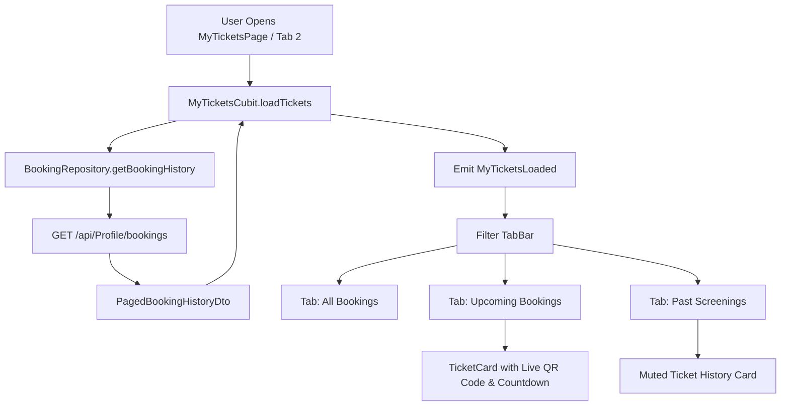

# Feature Deep-Dive: Profile, Settings & Tickets

> **Module Path:** `apps/mobile/lib/features/settings/`  
> **Key Files:** `settings_page.dart`, `edit_profile_page.dart`, `change_password_page.dart`, `my_tickets_page.dart`, `my_tickets_cubit.dart`, `profile_header.dart`, `premium_stats.dart`

---

## 1. Feature Overview

The **Profile, Settings & Tickets** module provides account management, security controls, customization, and ticket storage:
1. **Digital Ticket Wallet (`MyTicketsPage`):** Stores all active and past cinema tickets with QR codes, entry instructions, and filter tabs (`All`, `Upcoming`, `Past`).
2. **Profile Management (`EditProfilePage`):** Edit first name, last name, date of birth, and avatar.
3. **Security Management (`ChangePasswordPage`):** Update account password with current password verification.
4. **App Personalization:** Instant toggling of **Dark/Light Theme** and **Language (English/Arabic)**.
5. **Session Management:** Secure logout wiping tokens, cookies, and cached data.

---

## 2. Digital Ticket Wallet Architecture

---

## 3. Screen Inventory

| Screen | File Location | Route | Purpose |
| :--- | :--- | :--- | :--- |
| **Settings & Profile** | `features/settings/presentation/screens/settings_page.dart` | `'/settings'` | Account overview, theme switch, language selector, and navigation tiles. |
| **My Tickets** | `features/settings/presentation/screens/my_tickets_page.dart` | `'/my-tickets'` | Digital ticket wallet with QR codes and status indicators. |
| **Edit Profile** | `features/settings/presentation/screens/edit_profile_page.dart` | `'/edit-profile'` | Profile information editor and birthday selector. |
| **Change Password** | `features/settings/presentation/screens/change_password_page.dart` | `'/change-password'`| Old password check and new password confirmation. |
