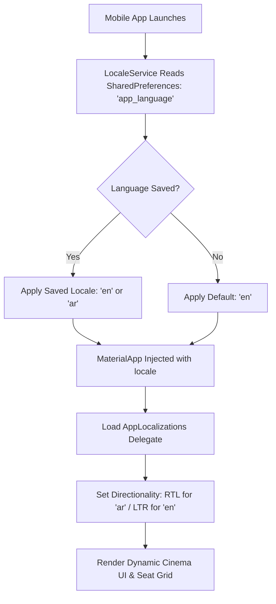

# Mobile Localization & Internationalization (i18n / l10n)

> **Module Path:** `apps/mobile/lib/l10n/` & `apps/mobile/lib/core/utils/localization_helper.dart`  
> **Supported Locales:** Arabic (`ar`), English (`en`)  
> **State Controller:** `LocaleService`  
> **Delegates:** `AppLocalizations`, `GlobalMaterialLocalizations`, `GlobalWidgetsLocalizations`, `GlobalCupertinoLocalizations`

---

## 1. Architectural Overview & Design Objectives

Ticketa mobile features full dual-language support with automatic RTL (Right-to-Left) and LTR (Left-to-Right) layout mirroring, localized typography, directional alignment, and dynamic in-app language switching without application restarts.



---

## 2. Supported Locales Catalog

| Language | ISO Code | Script Direction | Default Font Fallback | Translation File |
| :--- | :--- | :--- | :--- | :--- |
| **English** | `en` | **LTR** (Left to Right) | System / Material 3 Roboto/San Francisco | `lib/l10n/app_en.arb` |
| **العربية (Arabic)** | `ar` | **RTL** (Right to Left) | System Arabic / Cairo / Tajawal | `lib/l10n/app_ar.arb` |

---

## 3. Localization Architecture & Key Translation Groups

The localization dictionary is defined using standard Flutter ARB (Application Resource Bundle) format with 100% parity across English and Arabic:

### 3.1 Authentication & Profile Keys
- `appName`: App title ("Ticketa" / "تيكتا")
- `login`, `register`, `logout`, `email`, `password`, `confirmPassword`, `forgotPassword`
- `dontHaveAccount`, `alreadyHaveAccount`, `signInWithGoogle`
- `editProfile`, `changePassword`, `currentPassword`, `newPassword`, `saveChanges`

### 3.2 Movie Discovery & Details Keys
- `nowShowing`, `upcoming`, `topBooked`, `seeAll`
- `movieDetails`, `synopsis`, `cast`, `selectSeats`, `watchTrailer`
- `duration`, `minutes`, `rating`, `genre`

### 3.3 Cinema Hall & Seat Selection Keys
- `selectDate`, `selectTime`, `screenThisWay`
- `available`, `selected`, `reserved`, `vip`
- `seatNumber`, `row`, `hallType`, `totalPrice`

### 3.4 Payment & Ticket Keys
- `checkout`, `orderSummary`, `payWithCard`, `bookingSuccessful`
- `viewTickets`, `myTickets`, `scanQRCode`, `cinemaEntryNotice`

---

## 4. Layout Mirroring & Bidirectional Rules

1. **Directional Insets:** Layouts use `EdgeInsetsDirectional.fromSTEB` and `EdgeInsetsDirectional.only(start: ..., end: ...)` so that margins and paddings automatically flip when switching between Arabic and English.
2. **Icons & Chevrons:** Back buttons and disclosure arrows adapt to text directionality.
3. **Cinema Grid Coordinates:** Row labels (A, B, C...) and seat numbers maintain consistent screen-relative orientation while maintaining intuitive selection ergonomics.

---

## 5. Developer API & Helpers

### 5.1 Inline Helper: `localeCopy`
**File:** `apps/mobile/lib/core/utils/localization_helper.dart`

```dart
String localeCopy(BuildContext context, String en, String ar) {
  return Localizations.localeOf(context).languageCode == 'ar' ? ar : en;
}
```

### 5.2 Usage Patterns in UI
```dart
// Standard ARB string resolution
Text(AppLocalizations.of(context)!.nowShowing);

// Fast inline bilingual helper
Text(localeCopy(context, 'Standard Hall', 'صالة عادية'));
```
