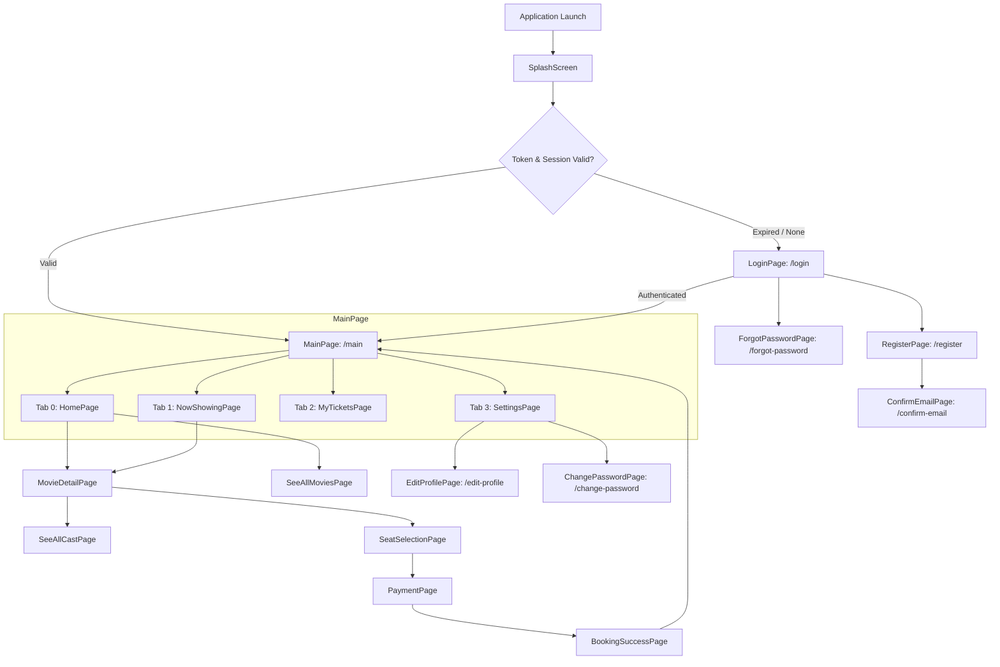

# Mobile Navigation & Routing Architecture

> **Files:** `apps/mobile/lib/app.dart`, `apps/mobile/lib/core/services/navigation_service.dart`, `apps/mobile/lib/features/main/presentation/screens/main_page.dart`  
> **Key Packages:** `google_nav_bar: ^5.0.6`, `cupertino_native: ^0.1.1`

---

## 1. Architectural Overview & Design Objectives

Ticketa mobile implements a hybrid routing paradigm combining:
1. **Named Declarative Routes:** For standalone modal flows, onboarding, and settings sub-pages.
2. **Tabbed Shell Navigation (`MainPage`):** Hosting the core discovery, cinema, tickets, and profile tabs inside an animated `IndexedStack`.
3. **Imperative Material Push Transitions:** For parameterized views (e.g. `MovieDetailPage`, `SeatSelectionPage`, `PaymentPage`, `BookingSuccessPage`, `SeeAllMoviesPage`, `SeeAllCastPage`).
4. **Context-Free Global Navigation:** Enabled by `getIt<NavigationService>().navigatorKey` for background session expiry and interceptor-driven redirects.

---

## 2. Complete Named Route Catalog (`app.dart:51-61`)

| Route Name | Target Widget Page | Access Control | Purpose |
| :--- | :--- | :--- | :--- |
| `'/'` (Home) | `SplashScreen` | Public | Boot verification, token checks, and route dispatching. |
| `'/login'` | `LoginPage` | Public | Email/password login and Google OAuth entrypoint. |
| `'/register'` | `RegisterPage` | Public | New account registration. |
| `'/confirm-email'` | `ConfirmEmailPage` | Public | 6-digit email confirmation OTP code verification. |
| `'/forgot-password'`| `ForgotPasswordPage`| Public | Password reset email submission flow. |
| `'/main'` | `MainPage` | Authenticated / Guest | 4-tab cinema exploration shell. |
| `'/settings'` | `SettingsPage` | Authenticated / Guest | User profile preferences and app settings. |
| `'/my-tickets'` | `MyTicketsPage` | Authenticated | QR code ticket repository and history. |
| `'/change-password'`| `ChangePasswordPage`| Authenticated | Secure password alteration. |
| `'/edit-profile'` | `EditProfilePage` | Authenticated | Profile avatar and user metadata editor. |

---

## 3. Parameterized & Modal Page Transitions

These routes are pushed dynamically with structured arguments:

| Destination Screen | Parameter Signature | Source Screens |
| :--- | :--- | :--- |
| `MovieDetailPage` | `movie: Movie` or `movieId: String` | `HomePage`, `NowShowingPage`, `SeeAllMoviesPage` |
| `SeeAllMoviesPage` | `title: String`, `movies: List<Movie>` | `HomePage` ("Now Showing", "Top Booked", "Upcoming") |
| `SeeAllCastPage` | `cast: List<CastMember>`, `movieTitle: String` | `MovieDetailPage` |
| `SeatSelectionPage`| `movie: Movie`, `showtime: ShowtimeInfo` | `MovieDetailPage` |
| `PaymentPage` | `showtimeSeat: ShowtimeSeatDto`, `selectedSeats: List<SeatDto>`, `totalAmount: double` | `SeatSelectionPage` |
| `BookingSuccessPage`| `bookingDetails: BookingDetailsDto` | `PaymentPage` |

---

## 4. Main Navigation Shell (`MainPage`)

`MainPage` is an adaptive navigation container supporting both native iOS Cupertino styling and Android floating glassmorphic `GNav` bar:

### 4.1 Tab Structure & Indices
- **Tab 0 (`Home`):** Hero movie carousel, trending films, upcoming screenings.
- **Tab 1 (`Now Showing`):** Interactive movie grid with category filtering.
- **Tab 2 (`My Tickets`):** Digital cinema tickets with QR codes and countdown timers.
- **Tab 3 (`Account / Settings`):** User profile, dark/light theme toggle, language picker.

### 4.2 Platform Adaptation
- **iOS:** Uses `CNTabBar` from `cupertino_native` with system SF Symbols (`house.fill`, `film.fill`, `ticket.fill`, `person.fill`).
- **Android:** Uses `GNav` from `google_nav_bar` wrapped in a floating frosted-glass container with `BackdropFilter` and haptic feedback.
- **RTL Reversal:** Dynamically reverses tab indexes (`3 - index`) in Arabic to maintain natural right-to-left thumb ergonomic flow.
