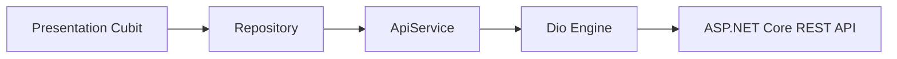

# Mobile Repositories & Data Access Reference

> **Directory:** `apps/mobile/lib/features/*/data/`  
> **Pattern:** Repository Pattern (Decoupling Data Sources from Presentation Cubits)

---

## 1. Architectural Overview

Repositories in the Ticketa mobile app serve as the single source of truth for all data operations. They encapsulate:
1. **Network Communication:** Dispatching HTTP verbs via `ApiService`.
2. **DTO Deserialization:** Converting raw dynamic JSON into strongly-typed domain models.
3. **Endpoint Resolution:** Utilizing static constants from `ApiConstants`.
4. **Error Boundary:** Allowing network and server exceptions to bubble up cleanly with formatted message payloads.

---

## 2. Complete Repository Catalog

### 2.1 `MovieRepository`
**File:** `apps/mobile/lib/features/home/data/movie_repository.dart`

Handles movie catalog discovery, trending rankings, and individual movie details.

| Method | Signature | Backend Endpoint | Description |
| :--- | :--- | :--- | :--- |
| `getNowShowing` | `Future<List<Movie>> getNowShowing()` | `GET /api/Movies/NowShowing` | Retrieves list of movies currently screening in theaters. |
| `getComingSoon` | `Future<List<Movie>> getComingSoon()` | `GET /api/Movies/coming-soon` | Retrieves upcoming cinema releases. |
| `getTopBooked` | `Future<List<Movie>> getTopBooked({int count = 6})` | `GET /api/Movies/top-booked?count=6` | Retrieves highest booked box office movies. |
| `getAllMovies` | `Future<List<Movie>> getAllMovies({int page, int pageSize})` | `GET /api/Movies?page=1&pageSize=20` | Paginated catalog feed of all movies. |
| `getMovieDetails`| `Future<Movie> getMovieDetails(String id)` | `GET /api/Movies/{id}` | Complete movie metadata including cast, showtimes, and trailer. |

---

### 2.2 `BookingRepository`
**File:** `apps/mobile/lib/features/booking/data/booking_repository.dart`

Manages showtime seat map retrieval, seat reservations, and user booking history.

| Method | Signature | Backend Endpoint | Description |
| :--- | :--- | :--- | :--- |
| `getSeatMap` | `Future<ShowtimeSeatDto> getSeatMap(int showtimeId)` | `GET /api/Showtimes/{id}/seats` | Retrieves seat grid dimensions, tier prices, and occupied seats. |
| `createBooking`| `Future<BookingResultDto> createBooking(BookingCreateDto dto)` | `POST /api/Bookings` | Submits seat coordinates to lock/create reservation. |
| `getBookingByReference`| `Future<BookingDetailsDto> getBookingByReference(String ref)` | `GET /api/Bookings/{ref}` | Retrieves detailed receipt and seat breakdown for a booking reference. |
| `getBookingHistory`| `Future<PagedBookingHistoryDto> getBookingHistory({page, pageSize, filter})` | `GET /api/Profile/bookings` | Retrieves user's booking history with tab filters (`All`, `Upcoming`, `Past`). |

---

### 2.3 `PaymentRepository`
**File:** `apps/mobile/lib/features/payment/data/payment_repository.dart`

Integrates with the server-side Stripe payment processing gateway.

| Method | Signature | Backend Endpoint | Description |
| :--- | :--- | :--- | :--- |
| `getConfig` | `Future<PaymentConfigDto> getConfig()` | `GET /api/Payments/config` | Fetches active Stripe publishable key. |
| `createIntent` | `Future<PaymentIntentResultDto> createIntent(CreatePaymentIntentDto dto)` | `POST /api/Payments/create-intent` | Initiates Stripe PaymentIntent for the selected seats and showtime. |
| `confirmPayment`| `Future<ConfirmPaymentResultDto> confirmPayment(String paymentIntentId)` | `POST /api/Payments/confirm-payment` | Confirms payment intent and finalizes cinema ticket issuance. |

---

### 2.4 `AuthRepository`
**File:** `apps/mobile/lib/features/auth/data/auth_repository.dart`

Handles identity management, user onboarding, security tokens, and profile updates.

| Method | Signature | Backend Endpoint | Description |
| :--- | :--- | :--- | :--- |
| `login` | `Future<Map<String, dynamic>> login(email, password)` | `POST /api/Auth/login` | Email/password credential verification. |
| `register` | `Future<Map<String, dynamic>> register(email, password, dob, firstName, lastName)` | `POST /api/Auth/register` | New account registration with date of birth. |
| `confirmEmail` | `Future<Map<String, dynamic>> confirmEmail(email, code)` | `POST /api/Auth/confirm-email` | 6-digit OTP code verification for email activation. |
| `resendConfirmation`| `Future<Map<String, dynamic>> resendConfirmation(email)` | `POST /api/Auth/resend-confirmation` | Dispatches new email verification code. |
| `logout` | `Future<void> logout()` | `POST /api/Auth/logout` | Revokes server session and cookies. |
| `refresh` | `Future<Map<String, dynamic>> refresh()` | `POST /api/Auth/refresh` | Rotates access token via HttpOnly cookie. |
| `forgotPassword`| `Future<Map<String, dynamic>> forgotPassword(email)` | `POST /api/Auth/forget-password`| Sends password reset instructions to user's inbox. |
| `loginWithGoogle`| `Future<Map<String, dynamic>> loginWithGoogle(idToken)` | `POST /api/Auth/google` | Exchanges Google OAuth token for Ticketa JWT. |
| `getProfile` | `Future<Map<String, dynamic>> getProfile()` | `GET /api/Profile` | Retrieves authenticated user's profile information. |
| `updateProfile`| `Future<Map<String, dynamic>> updateProfile({firstName, lastName, dateOfBirth, theme})` | `PUT /api/Profile` | Updates user details and preference metadata. |
| `changePassword`| `Future<Map<String, dynamic>> changePassword(currentPass, newPass)` | `PUT /api/Profile/password` | Changes user password. |
