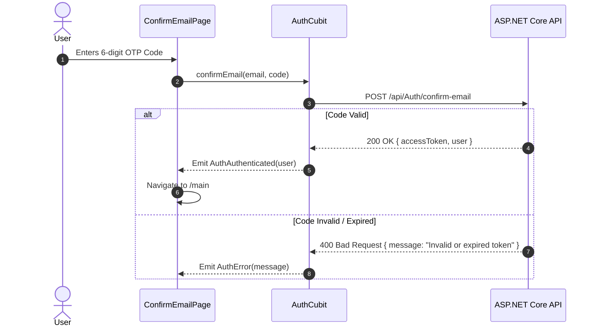

# Mobile Screen Deep-Dive: `ConfirmEmailPage`

> **File Path:** `apps/mobile/lib/features/auth/presentation/screens/confirm_email_page.dart`  
> **Route Name:** `'/confirm-email'`  
> **State Management:** `AuthCubit` (`flutter_bloc`)  
> **Parameters:** `email` (String)

---

## 1. Overview & Business Objectives

`ConfirmEmailPage` enforces email security via a 6-digit one-time confirmation code (OTP):
1. **Target Display:** Informs user of the email address receiving the activation token.
2. **OTP Code Inputs:** 6-digit numeric input with auto-focus advance and clipboard paste support.
3. **Resend Timer:** 60-second cooldown timer preventing spam requests.
4. **Auto-Login on Confirmation:** Upon successful verification, user is authenticated and forwarded to `MainPage`.

---

## 2. Verification Flow

