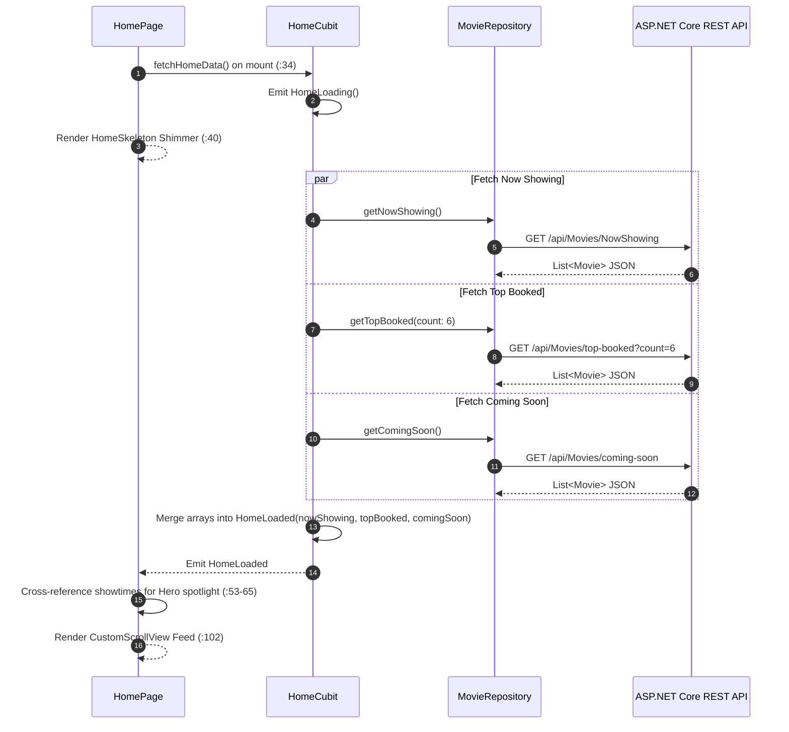
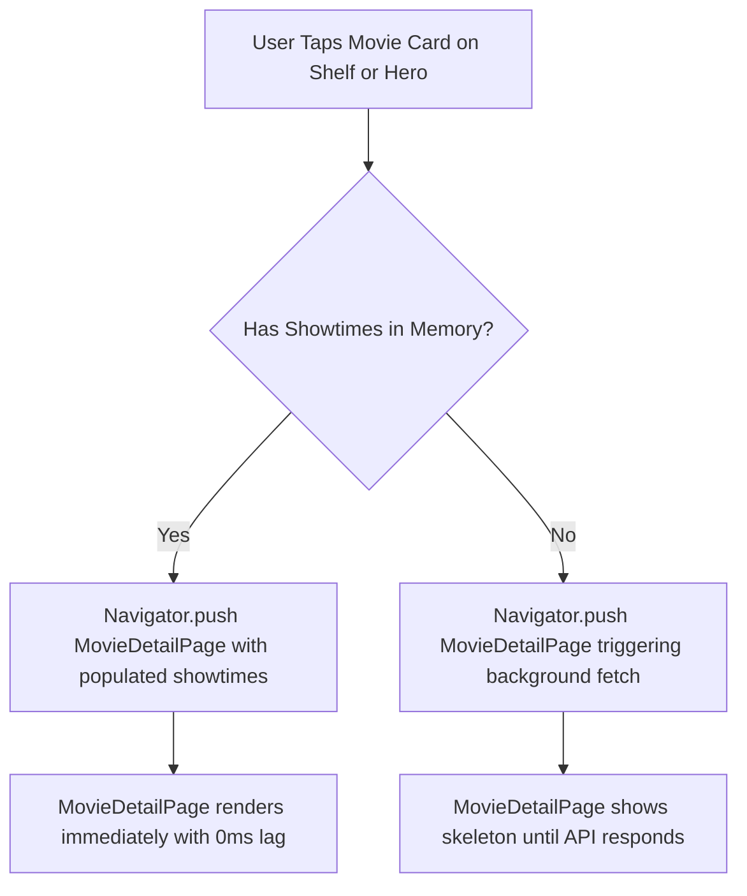

# Mobile Screen Deep-Dive: `HomePage`

> **Source File:** `apps/mobile/lib/features/home/presentation/screens/home_page.dart`  
> **Scale:** 256 lines of Dart code  
> **Route Name:** Tab 0 in `MainPage` (`'/main'`)  
> **Related Cubit:** `HomeCubit` (`flutter_bloc`)  
> **Target Framework:** Flutter 3.x / Dart 3.11

---

## 1. Overview

### 1.1 Purpose
`HomePage` serves as the commercial discovery portal and cinema storefront for Ticketa. It is designed to maximize moviegoer engagement through personalized greetings, dynamic parallax hero blockbusters, trending box-office carousels, and upcoming film releases.

### 1.2 Business Objective
Drive ticket bookings by presenting top-rated movies, trailers, and scheduled showtimes with frictionless one-tap entry into the movie detail and seat booking flow.

### 1.3 Key Functionality
- Parallel loading of `nowShowing`, `upcoming`, and `topBooked` films via `Future.wait`.
- Dynamic hero spotlight combining box-office ranking with active cinema showtime metadata.
- Interactive pull-to-refresh mechanism with animated skeleton loading (`HomeSkeleton`).
- Cross-tab shortcut to user profile via header avatar tap callback (`widget.onProfileAvatarTap`).
- Direct routing to filtered shelf views (`SeeAllMoviesPage`).

---

## 2. Screen Architecture & State Registry

```
Presentation Layer      HomePage (StatefulWidget) + HomeSkeleton
State Management        HomeCubit -> HomeState (HomeInitial, HomeLoading, HomeLoaded, HomeError)
Data Access             MovieRepository -> ApiService (GET /api/Movies/*)
```

### 2.1 State Variables Registry (`_HomePageState`)

| Variable Name | Type | Initial | Lines | Lifecycle & Purpose |
| :--- | :--- | :--- | :--- | :--- |
| `widget.onProfileAvatarTap` | `VoidCallback?` | `null` | `:18` | Callback dispatched when user taps header avatar to switch to Settings tab (Tab 3). |
| `_currentPage` | `int` | `1` | `:27` | Active PageView index pointer for hero parallax spotlight carousel. |

---

## 3. UI Component Hierarchy & Layout

```
Scaffold (backgroundColor: theme.scaffoldBackgroundColor :36)
+-- BlocProvider<HomeCubit> (:33)
    +-- BlocBuilder<HomeCubit, HomeState> (:37)
        +-- Case 1: Initial / Loading -> HomeSkeleton (:40)
        +-- Case 2: Error -> _buildErrorState (:45, :80-100)
        |   +-- Center -> Column -> Error Text + Retry Button (:82-98)
        +-- Case 3: Loaded -> _buildContent (:73, :102-256)
            +-- RefreshIndicator (onRefresh: cubit.fetchHomeData :104)
                +-- CustomScrollView (BouncingScrollPhysics :105)
                    +-- 1. SliverToBoxAdapter: Top Status Bar & HomeHeader (:110-128)
                    |   +-- User Greeting, Cinema Brand Logo, Profile Avatar Action
                    +-- 2. SliverToBoxAdapter: HomeHeroSection (:130-155)
                    |   +-- PageView Carousel with Backdrop Parallax, Rating, 'Book Tickets' CTA
                    +-- 3. SliverToBoxAdapter: Now Showing Section (:157-185)
                    |   +-- MovieHorizontalList with 'See All' Route Navigation
                    +-- 4. SliverToBoxAdapter: Top Booked Section (:187-215)
                    |   +-- MovieHorizontalList with Box-Office Rank Indicators
                    +-- 5. SliverToBoxAdapter: Coming Soon Section (:217-245)
                    |   +-- MovieHorizontalList with Release Date Badges
                    +-- 6. SliverToBoxAdapter: Bottom Navigation Spacer (height: 100px :250)
```

---

## 4. Workflows & Runtime Behavior

### Workflow 1: Parallel Data Ingestion & State Hydration



### Workflow 2: Hero Spotlight & Card Transitions



---

## 5. Method Catalog & Handlers

| Method | Signature | Verified Lines | Description |
| :--- | :--- | :--- | :--- |
| `_buildErrorState` | `Widget _buildErrorState(ThemeData, BuildContext, String)` | `:80-100` | Renders centered error icon, localized message, and retry button invoking `fetchHomeData()`. |
| `_buildContent` | `Widget _buildContent(ThemeData, AppLocalizations, ...)` | `:102-256` | Builds the unified sliver scroll feed coordinating header, hero spotlight, and horizontal shelves. |
| `_onSeeAllTapped` | `void _onSeeAllTapped(String title, List<Movie> list)` | `:170, :200, :230` | Pushes `SeeAllMoviesPage` passing section title and movies list. |

---

## 6. Security, Edge Cases & Optimizations

1. **Memory & Repaint Containment:** Each `MovieHorizontalList` uses a dedicated `ListView.builder` with `itemExtent` and `CachedNetworkImage` disk/memory deduplication to avoid frame drops during horizontal scrolling.
2. **Hero Fallback Matching (:53-65):** If a top-booked film is also currently screening in `nowShowing`, the app merges active auditorium showtimes into the hero card, unlocking instant 1-tap seat booking directly from the top banner.
3. **Empty Data Guard (:49-51):** If the backend returns an empty array for any section, the UI gracefully renders an empty shelf without crashing or throwing null errors.
