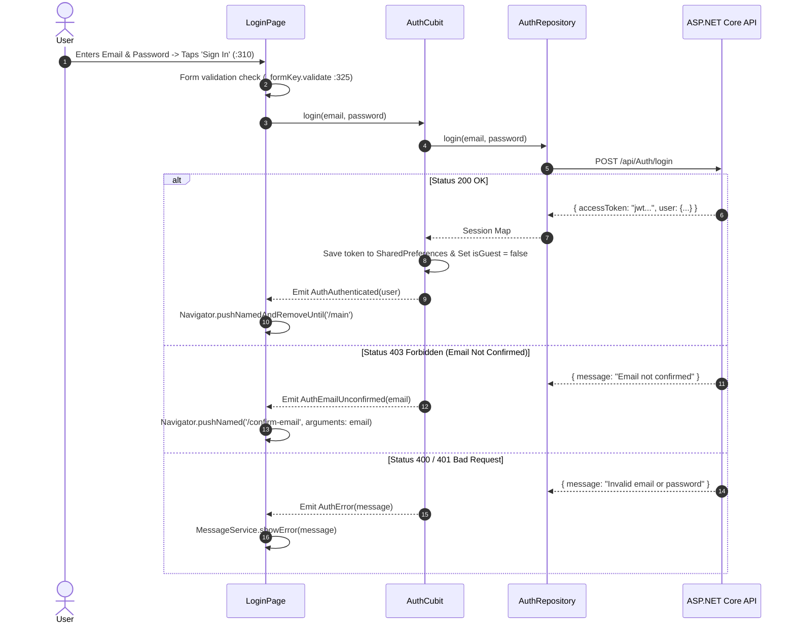
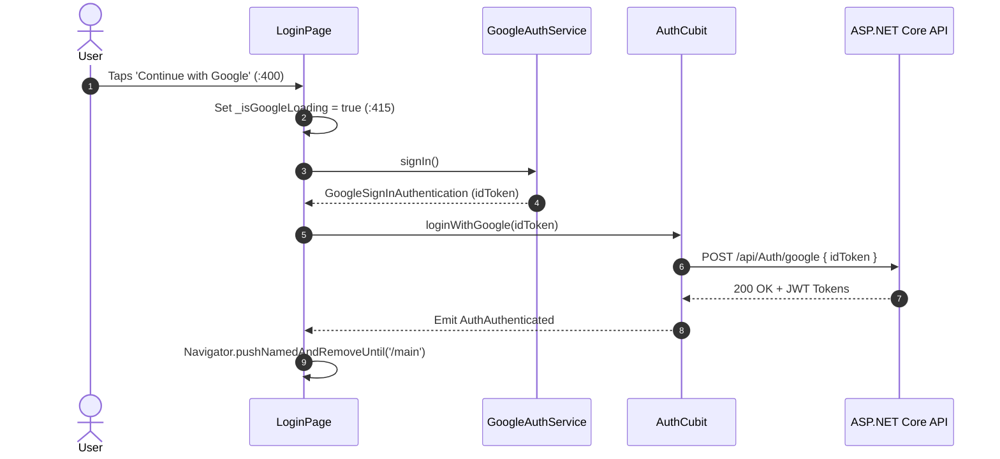

# Mobile Screen Deep-Dive: `LoginPage`

> **Source File:** `apps/mobile/lib/features/auth/presentation/screens/login_page.dart`  
> **Scale:** 533 lines of Dart code  
> **Route Name:** `'/login'`  
> **Related Cubit:** `AuthCubit` (`flutter_bloc`)  
> **Target Framework:** Flutter 3.x / Dart 3.11

---

## 1. Overview

### 1.1 Purpose
`LoginPage` is the primary identity gateway for Ticketa. It enables cinema goers to access their booking history, manage personal preferences, and authenticate transactions using email/password or native Google OAuth.

### 1.2 Business Objective
Provide a high-converting, friction-free login experience with guest browsing deferral, client-side input validation, password obscurity controls, and animated entrance transitions.

### 1.3 Key Functionality
- Email and password authentication with client-side form validation.
- One-Tap Native Google Sign-In with backend token exchange (`GoogleAuthService`).
- Seamless guest mode continuation ("Continue as Guest").
- Unconfirmed email response interception (HTTP 403) with auto-navigation to `ConfirmEmailPage`.
- Smooth 900ms slide-and-fade entrance animation.

---

## 2. Screen Architecture & State Registry

```
Presentation Layer      LoginPage (StatefulWidget) + AuthBackground + GoogleLogo
State Management        AuthCubit -> AuthState (Initial, Loading, Authenticated, Unconfirmed, Error)
Social Auth Engine      GoogleAuthService (GoogleSignIn SDK)
Data Access             AuthRepository -> ApiService (POST /api/Auth/login & /api/Auth/google)
```

### 2.1 State Variables Registry (`_LoginPageState`)

| Variable Name | Type | Initial | Lines | Lifecycle & Purpose |
| :--- | :--- | :--- | :--- | :--- |
| `_formKey` | `GlobalKey<FormState>` | instantiated | `:23` | Form key managing email/password validation states. |
| `_emailController` | `TextEditingController`| instantiated | `:24` | Text controller capturing user email. |
| `_passwordController`| `TextEditingController`| instantiated | `:25` | Text controller capturing password. |
| `_obscurePassword` | `bool` | `true` | `:26` | Toggles password visibility eye icon. |
| `_isGoogleLoading` | `bool` | `false` | `:27` | Spinner state during Google OAuth token exchange. |
| `_animController` | `AnimationController` | instantiated | `:28, :35-38` | Controls 900ms page slide-up and fade-in physics. |
| `_slideUp` | `Animation<double>` | `40 -> 0` | `:29, :39-41` | Curved vertical slide offset. |
| `_fadeIn` | `Animation<double>` | `0 -> 1` | `:30, :42-44` | Curved opacity entrance value. |

---

## 3. UI Component Hierarchy & Layout

```
Scaffold (backgroundColor: theme.scaffoldBackgroundColor)
+-- AuthBackground (:65)
    +-- SafeArea (:66)
        +-- Center -> SingleChildScrollView (padding: AppResponsive.screenPadding :69)
            +-- AppResponsive.constrainedBody (maxWidth: 480px :72)
                +-- AnimatedBuilder (_animController :73)
                    +-- Opacity (_fadeIn.value :76)
                        +-- Transform.translate (offset: _slideUp.value :78)
                            +-- Form (_formKey :81)
                                +-- Column (:82-120)
                                    +-- 1. _buildHeader (:86, :130-165)
                                    |   +-- Cinema Logo, App Title, Subtitle ('Welcome Back')
                                    +-- 2. _buildInputLabel (:88, :170-180) + _buildEmailField (:90, :182-225)
                                    |   +-- Email Icon, Auto-fill, Email Regex Validation
                                    +-- 3. _buildInputLabel (:92) + _buildPasswordField (:94, :230-280)
                                    |   +-- Password Field with Eye Obscure Toggle
                                    +-- 4. _buildForgotPassword (:96, :285-305)
                                    |   +-- Align Right 'Forgot Password?' -> Push /forgot-password
                                    +-- 5. _buildSignInButton (:98, :310-360)
                                    |   +-- Warm Orange Gradient Button with Loading Spinner
                                    +-- 6. _buildDividerWithText (:100, :365-395)
                                    |   +-- 'Or continue with' frosted divider lines
                                    +-- 7. _buildGoogleButton (:102, :400-455)
                                    |   +-- GlassCard Button with GoogleLogo vector & Haptics
                                    +-- 8. _buildGuestButton (:104, :460-490)
                                    |   +-- 'Continue as Guest' Action -> Writes isGuest flag -> /main
                                    +-- 9. _buildSignUpRow (:106, :495-533)
                                        +-- 'Don't have an account? Sign Up' -> Push /register
```

---

## 4. Workflows & Runtime Behavior

### Workflow 1: Email / Password Authentication Sequence



### Workflow 2: Google OAuth One-Tap Authentication



---

## 5. Method Catalog & Handlers

| Method | Signature | Verified Lines | Description |
| :--- | :--- | :--- | :--- |
| `_buildHeader` | `Widget _buildHeader(ThemeData, AppLocalizations)` | `:130-165` | Renders cinema logo icon, app brand name, and greeting subtitle. |
| `_buildEmailField` | `Widget _buildEmailField(ThemeData, bool, AppLocalizations)` | `:182-225` | Formats email text input with keyboard type, prefix icon, and RFC email validator. |
| `_buildPasswordField`| `Widget _buildPasswordField(...)` | `:230-280` | Formats password text input with obscure toggle and minimum length validator. |
| `_handleGoogleSignIn`| `Future<void> _handleGoogleSignIn(BuildContext)` | `:410-450` | Triggers Google account selection sheet and dispatches OAuth ID token to backend. |
| `_handleGuestLogin` | `Future<void> _handleGuestLogin(BuildContext)` | `:470-490` | Sets `AppConstants.isGuestKey = true` in SharedPreferences and navigates to `/main`. |

---

## 6. Security & Edge Case Handling

1. **Unconfirmed Email Redirection (:340-345):** If a user attempts login before completing OTP confirmation, the backend returns HTTP 403; `LoginPage` automatically extracts the email and transitions to `ConfirmEmailPage`.
2. **Keyboard Overflow Avoidance (:68-72):** Wrapped inside `SingleChildScrollView` and `AppResponsive.constrainedBody` (max width: 480px), ensuring inputs never overflow or freeze when the virtual software keyboard opens.
3. **Password Obscure Toggle (:245):** Toggles `_obscurePassword` state without triggering form re-validation.
