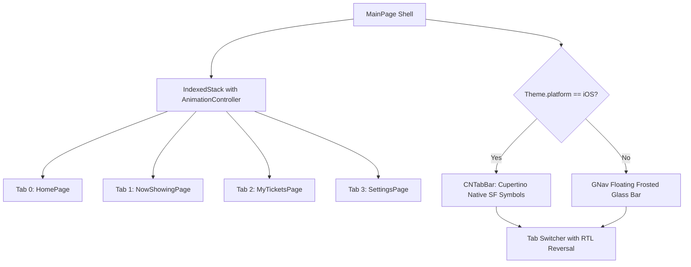

# Mobile Screen Deep-Dive: `MainPage`

> **File Path:** `apps/mobile/lib/features/main/presentation/screens/main_page.dart`  
> **Route Name:** `'/main'`  
> **Scale:** 243 lines of Dart code  
> **Tabs:** 4 Indexed Views (`HomePage`, `NowShowingPage`, `MyTicketsPage`, `SettingsPage`)  
> **Navigation UI:** iOS Native `CNTabBar` / Android Floating `GNav` Bar

---

## 1. Overview & Business Objectives

`MainPage` is the central navigation host for the Ticketa app. It hosts four distinct modules in an `IndexedStack` preserving tab state while providing smooth cross-tab animated transitions (fade + slight vertical slide).

---

## 2. Adaptive Navigation Architecture

---

## 3. Tab Index Matrix

| Index (LTR) | Index (RTL) | Tab Label | Icon (iOS / Android) | Screen Component |
| :--- | :--- | :--- | :--- | :--- |
| **0** | **3** | `Home` | `house.fill` / `Icons.movie_filter_rounded` | `HomePage` |
| **1** | **2** | `Now Showing` | `film.fill` / `Icons.local_play_rounded` | `NowShowingPage` |
| **2** | **1** | `My Tickets` | `ticket.fill` / `Icons.confirmation_number_rounded` | `MyTicketsPage` |
| **3** | **0** | `Account` | `person.fill` / `Icons.person_rounded` | `SettingsPage` |
