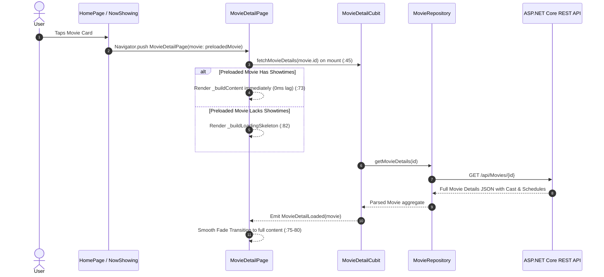
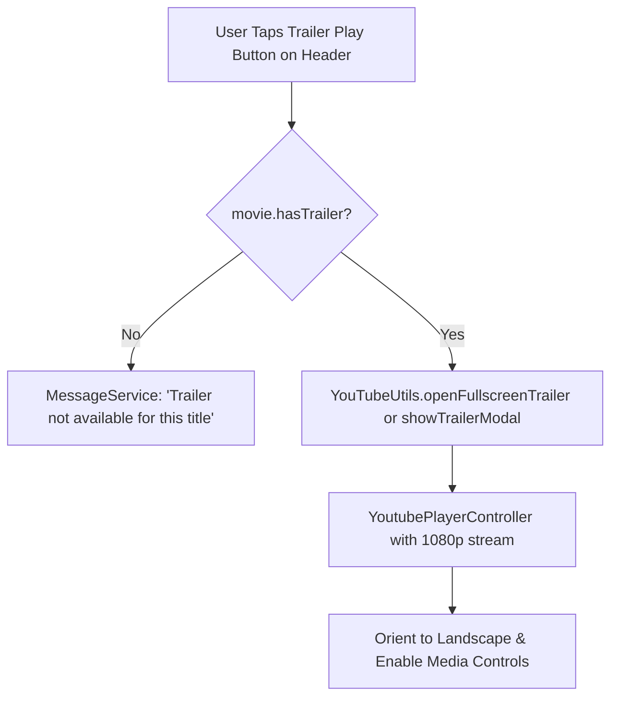

# Mobile Screen Deep-Dive: `MovieDetailPage`

> **Source File:** `apps/mobile/lib/features/home/presentation/screens/movie_detail_page.dart`  
> **Scale:** 176 lines of Dart code (coordinating 6 modular sub-widgets)  
> **Route Type:** Imperative MaterialPageRoute with `movie: Movie`  
> **Related Cubit:** `MovieDetailCubit` (`flutter_bloc`)  
> **Target Framework:** Flutter 3.x / Dart 3.11

---

## 1. Overview

### 1.1 Purpose
`MovieDetailPage` provides a comprehensive media showcase, syllabus inspection, trailer preview playback, and showtime schedule selector for a specific movie.

### 1.2 Business Objective
Drive ticket sales conversion by providing verified ratings, ensemble cast credentials, high-definition trailer streaming, and direct showtime auditorium selection.

### 1.3 Key Functionality
- Dynamic movie payload resolution with instant rendering of passed cached models.
- Asynchronous detailed fetch for rich cast and full showtime schedules via `MovieDetailCubit`.
- In-app YouTube trailer player modal and fullscreen landscape player (`FullscreenTrailerPlayer`).
- Interactive calendar date selector and auditorium time pill selector.
- Sticky bottom bar calculating available seat booking actions.

---

## 2. Screen Architecture & State Registry

```
Presentation Layer      MovieDetailPage (StatefulWidget) + FullscreenTrailerPlayer
State Management        MovieDetailCubit -> MovieDetailState (Initial, Loading, Loaded, Error)
Data Access             MovieRepository -> ApiService (GET /api/Movies/{id})
```

### 2.1 State Variables Registry (`_MovieDetailPageState`)

| Variable Name | Type | Initial | Lines | Lifecycle & Purpose |
| :--- | :--- | :--- | :--- | :--- |
| `widget.movie` | `Movie` | required | `:16` | Initial movie entity passed from previous screen (e.g. Home or NowShowing). |
| `widget.isComingSoon` | `bool` | `false` | `:17` | Flags upcoming movies to disable booking buttons and display "Coming Soon" badge. |
| `_isPlayingTrailer` | `bool` | `false` | `:30` | In-memory toggle controlling video playback modal states. |
| `_selectedShowtime` | `ShowtimeInfo?` | `null` | `:31` | User's active selected screening session with auditorium ID and pricing. |

---

## 3. UI Component Hierarchy & Layout

```
Scaffold (backgroundColor: theme.scaffoldBackgroundColor)
+-- BlocProvider<MovieDetailCubit> (:43)
    +-- BlocBuilder<MovieDetailCubit, MovieDetailState> (:46)
        +-- AnimatedSwitcher (fade duration: 350ms :75)
            +-- Branch A: Needs Skeleton -> _buildLoadingSkeleton (:81, :90-100)
            +-- Branch B: Main Content -> _buildContent (:83, :102-176)
                +-- Stack (children)
                    +-- CustomScrollView (BouncingScrollPhysics)
                    |   +-- 1. SliverAppBar / Header: MovieDetailHeader (:110-125)
                    |   |   +-- Blurred Backdrop Poster, Hero Image, Trailer Play Button, Back Action
                    |   +-- 2. SliverToBoxAdapter: MovieInfoSection (:127-140)
                    |   |   +-- Title, Release Year, Age Rating, Duration, Rating Score, Overview
                    |   +-- 3. SliverToBoxAdapter: MovieCastList (:142-152)
                    |   |   +-- Horizontal Cast Avatars + 'See All' Credit Trigger
                    |   +-- 4. SliverToBoxAdapter: MovieDateSelector & TimeSelector (:154-165)
                    |   |   +-- Interactive Calendar Day Carousel + Auditorium Showtimes
                    |   +-- 5. SliverToBoxAdapter: Bottom Spacer (height: 120px)
                    +-- Positioned Bottom: MovieDetailBottomBar (:168-175)
                        +-- Hall Tier Badge, Price Display, 'Select Seats' Action Button
```

---

## 4. Workflows & Runtime Behavior

### Workflow 1: Optimistic UI Rendering & Detail Fetching



### Workflow 2: YouTube Trailer Playback Pipeline



### Workflow 3: Date & Showtime Selection to Seat Map

```mermaid
flowchart TD
    SelectDate[User Taps Date Pill e.g. Tomorrow] --> FilterTimes[Filter movie.showtimeInfos for matching Day]
    FilterTimes --> DisplayTimes[Render TimeSelector with Hall Tags e.g. 19:30 IMAX]
    DisplayTimes --> SelectTime[User Taps Specific Showtime Pill]
    SelectTime --> UpdateBottom[MovieDetailBottomBar updates active hall & price]
    UpdateBottom --> TapSelectSeats[User Taps 'Select Seats' CTA]
    TapSelectSeats --> PushSeatMap[Navigator.push SeatSelectionPage(movie, showtime)]
```

---

## 5. Method Catalog & Handlers

| Method | Signature | Verified Lines | Description |
| :--- | :--- | :--- | :--- |
| `_buildLoadingSkeleton` | `Widget _buildLoadingSkeleton(ThemeData)` | `:90-100` | Renders themed shimmer placeholders for app bar, hero backdrop, and info tags. |
| `_buildContent` | `Widget _buildContent(ThemeData, AppLocalizations, Movie)` | `:102-176` | Builds the aggregate sliver scroll feed and positions the sticky bottom action bar. |
| `_onShowtimeSelected` | `void _onShowtimeSelected(ShowtimeInfo showtime)` | `:158` | Sets `_selectedShowtime` in local state, updating pricing and hall parameters. |

---

## 6. Security, Edge Cases & Performance

1. **Optimistic Showtimes Merging (:49-69):** If the movie passed from `HomePage` already has showtimes in memory, the screen skips the loading skeleton completely, creating an instantaneous 60 FPS page transition.
2. **Trailer URL Sanitization:** `YouTubeUtils.extractVideoId` defensively strips query parameters, playlist IDs, and malformed characters, ensuring the iframe decoder never crashes on unexpected URL formats.
3. **Coming Soon Gating (`isComingSoon == true`):** Automatically hides the showtime date selector and replaces the "Select Seats" button with a disabled "Coming Soon" notification pill.
