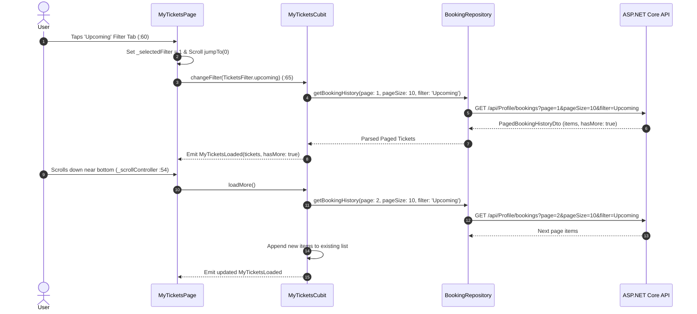
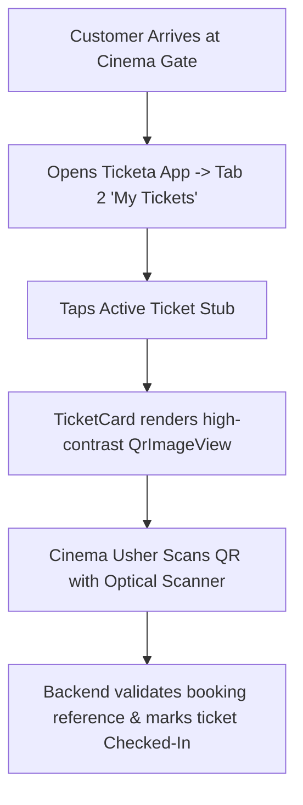

# Mobile Screen Deep-Dive: `MyTicketsPage`

> **Source File:** `apps/mobile/lib/features/settings/presentation/screens/my_tickets_page.dart`  
> **Scale:** 1,113 lines of Dart code  
> **Route Name:** Tab 2 in `MainPage` or named route `'/my-tickets'`  
> **Related Cubit:** `MyTicketsCubit` (`flutter_bloc`)  
> **Target Framework:** Flutter 3.x / Dart 3.11

---

## 1. Overview

### 1.1 Purpose
`MyTicketsPage` serves as the user's personal digital cinema passbook and ticket wallet. It manages active cinema passes, past booking receipts, live entry QR codes, countdown timers to showtime start, and ticket sharing.

### 1.2 Business Objective
Provide an effortless contactless cinema entry experience with zero-latency QR rendering, filterable booking history, infinite scroll pagination, and guest account handling.

### 1.3 Key Functionality
- Dynamic 3-way filter tabs: **All**, **Upcoming**, and **Past** screenings.
- Infinite scroll pagination loading additional booking pages via `ScrollController` listener.
- Perforated authentic cinema ticket stub UI (`TicketCard`) with notch cutouts and tear lines.
- Dynamic high-density vector QR code generated via `qr_flutter` embedding booking references.
- Showtime start countdown timers and status badges (`Confirmed`, `Completed`, `Cancelled`, `Refunded`).
- Guest mode empty state prompting users to sign in to access their tickets.

---

## 2. Screen Architecture & State Registry

```
Presentation Layer      MyTicketsPage (StatefulWidget) + TicketCard + QrImageView
State Management        MyTicketsCubit -> MyTicketsState (Initial, Loading, Loaded, Error)
Data Access             BookingRepository -> ApiService (GET /api/Profile/bookings)
```

### 2.1 State Variables Registry (`_MyTicketsPageState`)

| Variable Name | Type | Initial | Lines | Lifecycle & Purpose |
| :--- | :--- | :--- | :--- | :--- |
| `_scrollController` | `ScrollController` | instantiated | `:24, :34, :49` | List scroll controller detecting threshold to trigger `loadMore()`. |
| `_selectedFilter` | `int` | `0` | `:25` | Active filter index (0: All, 1: Upcoming, 2: Past). |
| `_cubitContext` | `BuildContext?` | `null` | `:26` | Retained context reference for pagination and filter triggers. |
| `_cached` | `MyTicketsLoaded?` | `null` | `:27` | Cached loaded state to prevent blank screen flicker during re-fetching. |
| `_isGuest` | `bool` | `true` | `:28` | Tracks whether the active user is a guest or authenticated customer. |
| `_checkingAuth` | `bool` | `true` | `:29` | Initial flag while reading session credentials from SharedPreferences. |

---

## 3. UI Component Hierarchy & Layout

```
Scaffold (backgroundColor: theme.scaffoldBackgroundColor)
+-- Conditional View:
    +-- Branch A: Checking Auth -> AppBar + Loading Shimmer (:91-110)
    +-- Branch B: Guest View -> Unauthenticated Wallet Placeholder (:115-180)
    |   +-- Centered Card with Lock & Ticket Icon
    |   +-- 'Sign In to Access Your Cinema Passes'
    |   +-- 'Login' / 'Register' Action Buttons
    +-- Branch C: Authenticated Wallet View (:185-1113)
        +-- BlocProvider<MyTicketsCubit> (:190)
            +-- BlocConsumer<MyTicketsCubit, MyTicketsState> (:195)
                +-- NestedScrollView / CustomScrollView
                    +-- 1. SliverAppBar with Cinema Wallet Header (:200-240)
                    +-- 2. SliverToBoxAdapter: Filter Tab Selector (All / Upcoming / Past) (:245-290)
                    +-- 3. SliverList / ListView.builder (:295-650)
                        +-- TicketCard Items (for each BookingHistoryItemDto)
                            +-- Movie Poster & Backdrop
                            +-- Movie Title & Hall Type Badge (IMAX / Gold / Standard)
                            +-- Screening Date & Time (formatted via DateFormat)
                            +-- Seats List (e.g. 'Row 3: Seats 4, 5, 6')
                            +-- Perforation Line & Cutout Notches
                            +-- Dynamic Vector QR Code (QrImageView with bookingReference)
                            +-- Status Badge (Emerald Green 'Confirmed', Amber 'Pending', Grey 'Past')
```

---

## 4. Workflows & Runtime Behavior

### Workflow 1: Filter Switching & Infinite Pagination



### Workflow 2: QR Code Gate Scanning Verification



---

## 5. Method Catalog & Handlers

| Method | Signature | Verified Lines | Description |
| :--- | :--- | :--- | :--- |
| `_loadAuth` | `Future<void> _loadAuth()` | `:38-45` | Reads `isGuestKey` from disk and sets auth state. |
| `_onScroll` | `void _onScroll()` | `:53-58` | Detects when scroll position is within 300px of max scroll extent to load next page. |
| `_onFilterChanged` | `void _onFilterChanged(int, MyTicketsState)` | `:60-72` | Switches filter between All, Upcoming, and Past with auto-scroll reset. |
| `_visibleTickets` | `List<BookingHistoryItemDto> _visibleTickets(...)` | `:74-84` | Client-side filter helper for instant tab responsiveness. |

---

## 6. Security & Performance Notes

1. **Vector QR Code Integrity:** Uses `QrImageView` with error correction level `QrErrorCorrectLevel.M`, allowing optical scanners to read codes even on cracked or scratched phone screens.
2. **Infinite Scroll Debouncing (:54-57):** The scroll listener checks `state.hasMore && !state.isLoadingMore` before dispatching network requests, preventing spamming duplicate API calls on fast swipes.
3. **Memory Optimization on Large Histories:** Utilizes `ListView.builder` with `CachedNetworkImage` memory cache constraints (`memCacheWidth: 300`) to ensure 60 FPS scrolling across hundreds of past tickets.
