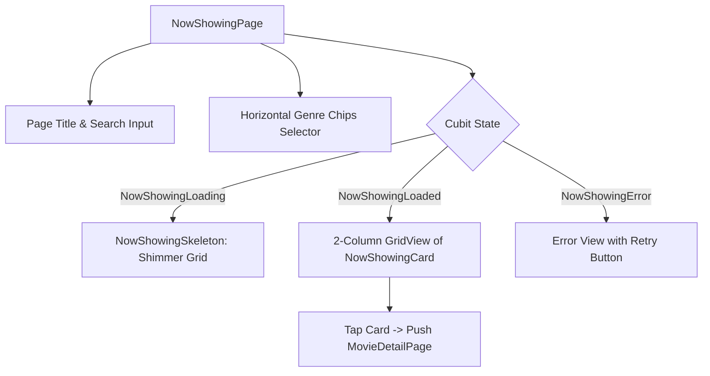

# Mobile Screen Deep-Dive: `NowShowingPage`

> **File Path:** `apps/mobile/lib/features/now_showing/presentation/screens/now_showing_page.dart`  
> **Route Name:** Tab 1 in `MainPage` (`'/main'`)  
> **State Management:** `NowShowingCubit` (`flutter_bloc`)  
> **Layout:** Search bar, horizontal genre chips, 2-column movie grid

---

## 1. Overview & Business Objectives

`NowShowingPage` gives cinema goers dedicated access to all films currently screening in theaters:
1. **Interactive Search:** Live client-side search across movie titles and genres.
2. **Category Chips:** Filter by genre (All, Action, Comedy, Drama, Sci-Fi, Horror, Romance...).
3. **Now Showing Grid:** Detailed cards showing poster, rating, runtime, and instant booking trigger.
4. **Pull to Refresh:** Refreshes the theater catalog directly from the API.

---

## 2. Screen Architecture & Composition

