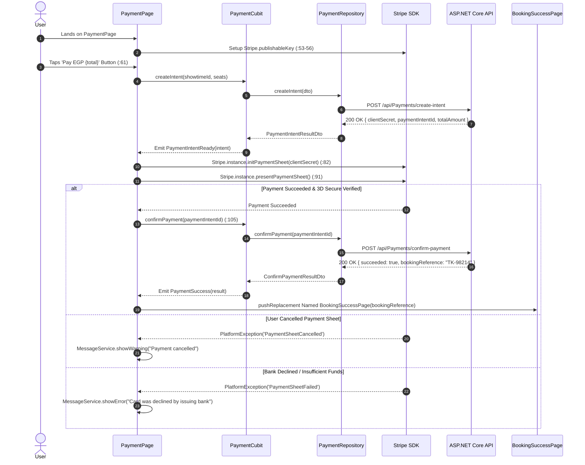

# Mobile Screen Deep-Dive: `PaymentPage`

> **Source File:** `apps/mobile/lib/features/payment/presentation/screens/payment_page.dart`  
> **Scale:** 249 lines of Dart code  
> **Route Type:** Imperative MaterialPageRoute with checkout arguments  
> **Related Cubit:** `PaymentCubit` (`flutter_bloc`)  
> **SDK Integration:** `flutter_stripe: ^14.0.0` (Stripe Payment Sheet SDK)

---

## 1. Overview

### 1.1 Purpose
`PaymentPage` executes the financial checkout flow via Stripe, verifying customer card details, handling 3D Secure bank challenges, creating backend ticket reservations, and triggering ticket issuance.

### 1.2 Business Objective
Provide an ultra-secure, PCI-DSS compliant checkout flow that minimizes checkout friction, prevents double-charges, and handles bank declines gracefully.

### 1.3 Key Functionality
- Direct initialization of Stripe Payment Sheet with ephemeral client secrets.
- Full support for Apple Pay, Google Pay, and international Credit/Debit Cards.
- Itemized billing card (`OrderSummary`) showing seats, hall, and price breakdown.
- Dynamic error banners translating Stripe failure codes into friendly localized messages.
- Automatic navigation to `BookingSuccessPage` upon verified payment confirmation.

---

## 2. Screen Architecture & State Registry

```
Presentation Layer      PaymentPage (StatefulWidget) + OrderSummary
State Management        PaymentCubit -> PaymentState (Idle, Loading, IntentReady, Success, Failure)
Payment Engine          Stripe Native SDK (PaymentSheet / 3D Secure)
Data Access             PaymentRepository -> ApiService (POST /api/Payments/*)
```

### 2.1 State Variables Registry (`_PaymentPageState`)

| Variable Name | Type | Initial | Lines | Lifecycle & Purpose |
| :--- | :--- | :--- | :--- | :--- |
| `widget.totalAmount` | `double` | required | `:19` | Total transaction amount to be charged. |
| `widget.movieTitle` | `String` | required | `:20` | Movie title for billing invoice summary. |
| `widget.seats` | `List<SeatDto>`| required | `:21` | Selected seat coordinates (e.g. `[SeatDto(row: 2, seatNumber: 4)]`). |
| `widget.date` | `String` | required | `:22` | Formatted screening date. |
| `widget.time` | `String` | required | `:23` | Formatted screening time. |
| `widget.showtimeId` | `int` | required | `:25` | Showtime ID associated with the booking order. |
| `widget.moviePoster`| `String?` | `null` | `:26` | Movie poster path rendered in order summary. |
| `widget.hallName` | `String?` | `null` | `:27` | Auditorium hall name. |

---

## 3. UI Component Hierarchy & Layout

```
Scaffold (backgroundColor: theme.scaffoldBackgroundColor)
+-- BlocProvider<PaymentCubit>
    +-- BlocConsumer<PaymentCubit, PaymentState>
        +-- Listener: Captures PaymentSuccess -> Navigates to BookingSuccessPage (:110-125)
        +-- Builder:
            +-- Stack (children)
                +-- SingleChildScrollView (padding: 20px, bottom padding: 120px)
                |   +-- 1. Custom Back Button & Page Header (:130-145)
                |   +-- 2. OrderSummary Card (:150-170)
                |   |   +-- Movie Poster Thumbnail, Title, Hall Tier, Date & Time
                |   |   +-- Seats List (e.g. 'R1-S4, R1-S5')
                |   +-- 3. Price Calculation Matrix (:175-195)
                |   |   +-- Subtotal, Service Fee, VAT Tax, Final Total Amount
                |   +-- 4. Security & Compliance Badges (:200-215)
                |       +-- Stripe 256-bit SSL Encryption, PCI-DSS Level 1 Guarantee
                +-- Positioned Bottom: Sticky Pay Button Bar (:220-249)
                    +-- Elevated Action Button: 'Pay EGP {totalAmount}'
                    +-- Loading Spinner indicator during verification
```

---

## 4. Workflows & Runtime Behavior

### Workflow 1: Complete Stripe Payment Pipeline



---

## 5. Method Catalog & Handlers

| Method | Signature | Verified Lines | Description |
| :--- | :--- | :--- | :--- |
| `_setupStripe` | `Future<void> _setupStripe()` | `:53-56` | Injects backend publishable key into `Stripe.publishableKey` and applies settings. |
| `_seatLabels` | `List<String> get _seatLabels` | `:58-60` | Formats raw seats into standard `R{row}-S{seat}` strings. |
| `_onPayPressed` | `Future<void> _onPayPressed(BuildContext)`| `:61-110` | Coordinates intent generation, Stripe Sheet presentation, and backend payment confirmation. |

---

## 6. Security & Edge Case Handling

1. **Double-Click Debounce (:68-78):** If the payment intent is already created in memory (`state is PaymentIntentReady`), subsequent taps on the pay button immediately present the existing sheet rather than duplicating backend intents.
2. **Cancellation Gracefulness (:94-100):** If a user dismisses the Stripe sheet, the screen does not reset the form, allowing the user to select another card or retry without losing their selected seats.
3. **Session Loss Fallback:** If the app background isolate terminates during 3D Secure, the backend webhook reconciles the payment asynchronously, ensuring tickets are never lost.
