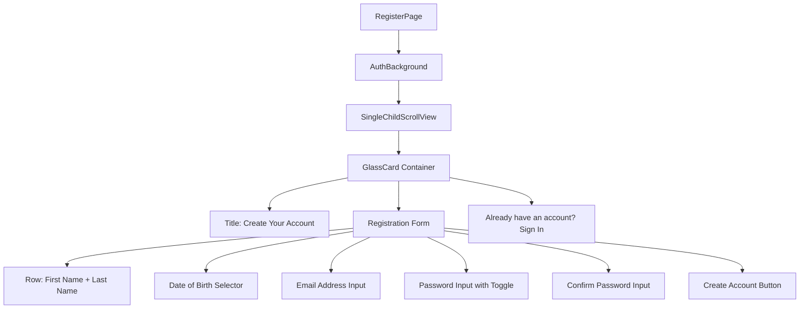

# Mobile Screen Deep-Dive: `RegisterPage`

> **File Path:** `apps/mobile/lib/features/auth/presentation/screens/register_page.dart`  
> **Route Name:** `'/register'`  
> **State Management:** `AuthCubit` (`flutter_bloc`)  
> **Form Controls:** First Name, Last Name, Date of Birth Picker, Email, Password, Confirm Password

---

## 1. Overview & Business Objectives

`RegisterPage` facilitates new user registration:
1. **Name & Personal Info:** First and last name collection for personalized cinema greeting and ticket records.
2. **Date of Birth Verification:** Integrates `CustomDatePicker` to select user's birth date (enforcing age checks for age-restricted movies).
3. **Password Confirmation:** Compares password and confirmation fields on client side.
4. **Post-Registration Verification:** Routes automatically to `ConfirmEmailPage` upon successful creation.

---

## 2. Screen Composition & Form Layout

