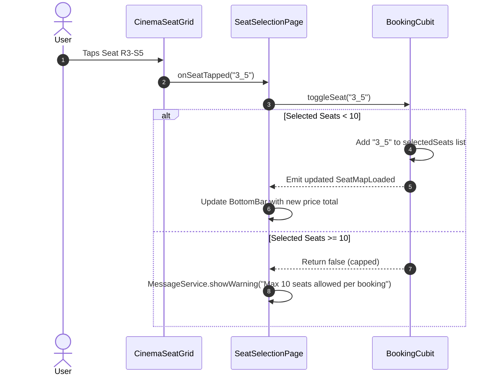

# Mobile Screen Deep-Dive: `SeatSelectionPage`

> **Source File:** `apps/mobile/lib/features/booking/presentation/screens/seat_selection_page.dart`  
> **Scale:** 374 lines of Dart code (coordinating 7 modular widgets)  
> **Route Type:** Imperative MaterialPageRoute with showtime & movie parameters  
> **Related Cubit:** `BookingCubit` (`flutter_bloc`)  
> **Target Framework:** Flutter 3.x / Dart 3.11

---

## 1. Overview

### 1.1 Purpose
`SeatSelectionPage` is the real-time interactive cinema seating matrix and auditorium reservation interface. It gives users complete visual control over selecting their seats with live pricing calculations and projection screen visualization.

### 1.2 Business Objective
Provide an intuitive, low-latency, and error-free seat reservation process while enforcing business constraints (maximum 10 seats per booking, seat categorization tiers, and concurrency locks).

### 1.3 Key Functionality
- Custom vector-drawn curved cinema screen (`CinemaScreenPainter`) simulating IMAX, Gold, and Standard auditorium types.
- Multi-row interactive seating matrix (`CinemaSeatGrid`) with real-time selection states.
- Dynamic date and showtime switching with automatic seat map re-fetching.
- Selection limits (enforces maximum 10 seats per booking).
- Sticky checkout bar with dynamic price summation and seat coordinates display.

---

## 2. Screen Architecture & State Registry

```
Presentation Layer      SeatSelectionPage (StatefulWidget) + CinemaSeatGrid + CinemaScreenPainter
State Management        BookingCubit -> BookingState (BookingInitial, BookingLoading, SeatMapLoaded, BookingError)
Data Access             BookingRepository -> ApiService (GET /api/Showtimes/{id}/seats)
```

### 2.1 State Variables Registry (`_SeatSelectionPageState`)

| Variable Name | Type | Initial | Lines | Lifecycle & Purpose |
| :--- | :--- | :--- | :--- | :--- |
| `widget.movieTitle` | `String` | required | `:20` | Title of the movie being booked. |
| `widget.showtimeId` | `int` | required | `:21` | Active showtime identifier. |
| `widget.showtimeInfos`| `List<ShowtimeInfo>`| `[]` | `:22` | Full array of scheduled screening times for quick date/time switching. |
| `widget.basePrice` | `double` | required | `:23` | Default standard seat price. |
| `widget.hallName` | `String` | `''` | `:24` | Name of the screening auditorium. |
| `widget.moviePoster` | `String?` | `null` | `:25` | Movie poster path passed forward to checkout. |
| `_selectedDateIndex` | `int` | `0` | `:42` | Active pointer in the horizontal date picker carousel. |
| `_selectedTimeIndex` | `int` | `0` | `:43` | Active pointer in the horizontal showtime hour selector. |

---

## 3. UI Component Hierarchy & Layout

```
Scaffold (backgroundColor: theme.scaffoldBackgroundColor)
+-- BlocProvider<BookingCubit> (creates cubit ..loadSeatMap(showtimeId))
    +-- BlocConsumer<BookingCubit, BookingState>
        +-- Listener: Error banners & seat conflict dialogs (:110-130)
        +-- Builder:
            +-- Stack (children)
                +-- Column (:135)
                |   +-- 1. SeatSelectionAppBar (:140)
                |   |   +-- Back Action, Movie Title, Hall Name, Screening Time Tag
                |   +-- 2. SeatDateSelector & TimeSelector (:145-165)
                |   |   +-- Quick 14-day date selector and showtime pills
                |   +-- 3. Expanded: InteractiveViewer (pan & zoom enabled :170)
                |       +-- SingleChildScrollView
                |           +-- Column (:175-230)
                |               +-- CinemaScreenPainter (Curved screen + Projector beam)
                |               +-- SizedBox (height: 24)
                |               +-- CinemaSeatGrid (Dynamic rows & columns)
                |               +-- SizedBox (height: 24)
                |               +-- SeatLegend (Available / Selected / Reserved / VIP)
                +-- Positioned Bottom: SeatSelectionBottomBar (:240-280)
                    +-- Selected Seats Count (e.g. '3 Seats: R2-S4, R2-S5, R2-S6')
                    +-- Total Calculated Sum (e.g. 'EGP 360.00')
                    +-- 'Continue to Checkout' Button
```

---

## 4. Workflows & Runtime Behavior

### Workflow 1: Seat Toggle & Concurrency State Flow



### Workflow 2: Date / Time Switching Pipeline

```mermaid
flowchart TD
    UserTap[User Taps Different Date / Time Pill] --> UpdateIndex[Update _selectedDateIndex / _selectedTimeIndex]
    UpdateIndex --> ResolveShowtime[Resolve _activeShowtime from showtimeInfos list]
    ResolveShowtime --> FetchMap[BookingCubit.loadSeatMap(newShowtimeId)]
    FetchMap --> ResetSelection[Clear existing selectedSeats array]
    ResetSelection --> RenderNewGrid[CinemaSeatGrid renders updated bookedSeats and pricing tiers]
```

---

## 5. Method Catalog & Handlers

| Method | Signature | Verified Lines | Description |
| :--- | :--- | :--- | :--- |
| `_availableDays` | `List<DateTime> get _availableDays` | `:45-55` | Computes unique sorted calendar days from `showtimeInfos`. |
| `_dayTimes` | `List<ShowtimeInfo> get _dayTimes` | `:57-70` | Filters showtimes belonging strictly to the selected day. |
| `_activeShowtime` | `ShowtimeInfo? get _activeShowtime`| `:72-76` | Returns the active `ShowtimeInfo` object based on indices. |
| `_onDateSelected` | `void _onDateSelected(BuildContext, int)` | `:78-87` | Updates selected date, resets time index to 0, and triggers `loadSeatMap`. |
| `_onTimeSelected` | `void _onTimeSelected(BuildContext, int)` | `:89-95` | Updates selected time index and triggers `loadSeatMap`. |
| `_onContinuePressed`| `void _onContinuePressed(BuildContext)` | `:260-275`| Validates minimum 1 seat selected and navigates to `PaymentPage`. |

---

## 6. Security, Edge Cases & Business Constraints

1. **Max Seat Restriction (:30-46 in `booking_cubit.dart`):** Enforces strict maximum of 10 seats per booking order to prevent commercial ticket scalping.
2. **Dynamic Tier Pricing:** If a hall features VIP rows, the price calculation sums individual row prices (`categoryPrices[rowCategoryMap[row]]`) rather than simply multiplying `basePrice * count`.
3. **Pinch-to-Zoom Support:** Uses `InteractiveViewer` with `minScale: 0.8` and `maxScale: 2.5` to ensure large 20+ row cinema halls remain fully navigable on small mobile screens.
