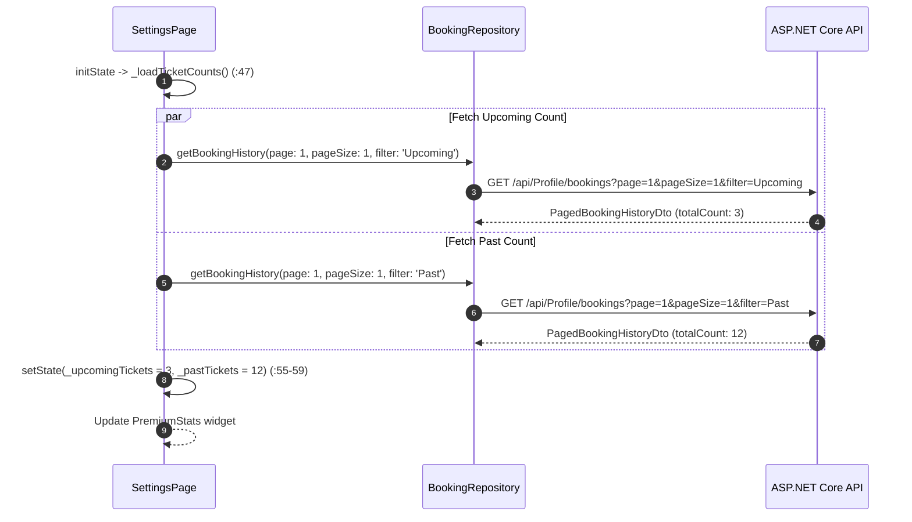

# Mobile Screen Deep-Dive: `SettingsPage`

> **Source File:** `apps/mobile/lib/features/settings/presentation/screens/settings_page.dart`  
> **Scale:** 394 lines of Dart code  
> **Route Name:** Tab 3 in `MainPage` or named route `'/settings'`  
> **Related Controllers:** `ThemeService`, `LocaleService`, `AuthRepository`, `BookingRepository`  
> **Target Framework:** Flutter 3.x / Dart 3.11

---

## 1. Overview

### 1.1 Purpose
`SettingsPage` serves as the central account management, theme customization, language switching, ticket counts overview, and session control interface.

### 1.2 Business Objective
Provide authenticated users with effortless account management while offering guests clear, non-intrusive incentives to sign up or log in.

### 1.3 Key Functionality
- Dual View Layout: Adapts between **Guest View** (`_buildGuestView`) and **Authenticated Profile View** (`_buildSettingsView`).
- Live statistics banner (`PremiumStats`) displaying upcoming tickets and watched movie counts loaded in parallel.
- Instantaneous **Dark Mode (Cinema Theme)** and **Light Mode** toggle via `ThemeService`.
- Multi-language modal selector via `LocaleService` and `LanguageSelector`.
- Navigation hubs to `EditProfilePage`, `ChangePasswordPage`, and `MyTicketsPage`.
- Secure session termination and credential cleanup.

---

## 2. Screen Architecture & State Registry

```
Presentation Layer      SettingsPage (StatefulWidget) + ProfileHeader + PremiumStats + SettingsTile
State Management        Provider (ThemeService, LocaleService) + AuthCubit
Data Access             BookingRepository (GET /api/Profile/bookings) + AuthRepository (POST /api/Auth/logout)
```

### 2.1 State Variables Registry (`_SettingsPageState`)

| Variable Name | Type | Initial | Lines | Lifecycle & Purpose |
| :--- | :--- | :--- | :--- | :--- |
| `_isLoading` | `bool` | `true` | `:25` | Initial loading flag while checking session credentials from disk. |
| `_isGuest` | `bool` | `true` | `:26` | Determines whether to render the guest call-to-action or full user profile. |
| `_upcomingTickets` | `int` | `0` | `:27` | Counter of active future cinema bookings. |
| `_pastTickets` | `int` | `0` | `:28` | Counter of past completed cinema screenings. |
| `_ticketsLoaded` | `bool` | `false` | `:29` | Indicates whether ticket counts have been successfully fetched. |

---

## 3. UI Component Hierarchy & Layout

```
Scaffold (backgroundColor: theme.scaffoldBackgroundColor)
+-- Conditional View:
    +-- Branch A: Guest View (_buildGuestView :80-160)
    |   +-- Centered Container -> Icon Badge + 'Join Ticketa' Title
    |   +-- Guest Benefits List (Discounts, Digital QR Passes, Seat Booking)
    |   +-- 'Sign In' Button -> /login
    |   +-- 'Create Account' Button -> /register
    |   +-- App Preferences Section (Theme Toggle & Language Selector)
    +-- Branch B: Authenticated View (_buildSettingsView :165-394)
        +-- SafeArea -> SingleChildScrollView (padding: 20px)
            +-- 1. ProfileHeader (:170-195)
            |   +-- User Avatar, Name, Email, VIP Tier Badge, Edit Shortcut
            +-- 2. PremiumStats Banner (:200-220)
            |   +-- Upcoming Tickets Count, Past Movies Count, Loyalty Score
            +-- 3. Account Section (:225-270)
            |   +-- SettingsTile: Edit Profile -> /edit-profile
            |   +-- SettingsTile: Change Password -> /change-password
            |   +-- SettingsTile: My Tickets Wallet -> /my-tickets
            +-- 4. Preferences Section (:275-330)
            |   +-- SettingsTile: Dark Mode Switch (Consumer<ThemeService>)
            |   +-- SettingsTile: Language Selector (Consumer<LocaleService>)
            +-- 5. Danger Zone / Logout Section (:335-385)
                +-- SettingsTile: Logout Action with Alert Dialog confirmation
```

---

## 4. Workflows & Runtime Behavior

### Workflow 1: Ticket Counters Parallel Hydration



### Workflow 2: Secure Logout Sequence

```mermaid
flowchart TD
    UserTap[User Taps 'Logout' Tile] --> ConfirmDialog[Show Confirmation AlertDialog]
    ConfirmDialog -->|Cancel| Dismiss[Dismiss Dialog]
    ConfirmDialog -->|Confirm| CallLogout[AuthRepository.logout -> POST /api/Auth/logout]
    CallLogout --> ClearStorage[Wipe SharedPreferences tokens, email, and cookies]
    ClearStorage --> ResetNav[NavigationService.pushNamedAndRemoveUntil('/login')]
```

---

## 5. Method Catalog & Handlers

| Method | Signature | Verified Lines | Description |
| :--- | :--- | :--- | :--- |
| `_loadAuth` | `Future<void> _loadAuth()` | `:38-45` | Reads `isGuestKey` from `SharedPreferences` and toggles `_isGuest`. |
| `_loadTicketCounts` | `Future<void> _loadTicketCounts()` | `:47-64` | Concurrently fetches total counts for `Upcoming` and `Past` tickets. |
| `_buildGuestView` | `Widget _buildGuestView(ThemeData, bool)` | `:80-160` | Builds unauthenticated onboarding UI with login/signup CTAs. |
| `_buildSettingsView`| `Widget _buildSettingsView(ThemeData, bool)` | `:165-394` | Builds authenticated dashboard with profile, stats, tiles, and logout. |
| `_showLogoutDialog` | `void _showLogoutDialog(BuildContext)` | `:345-385` | Prompts user with custom themed modal before session termination. |

---

## 6. Security, Theme & Localization Notes

1. **Optimized Stats Queries (:51-53):** By specifying `pageSize: 1`, the app minimizes network payload size to less than 1KB while still obtaining the exact database `totalCount` header for user statistics.
2. **Instant Theme Mode Reactivity (:280-300):** Toggling dark mode notifies `ThemeService` without recreating screen states or causing navigation rebuilds.
3. **Session Purge Guarantee:** The logout pipeline explicitly invokes `cookieJar.deleteAll()` to prevent stale `refreshToken` cookies from persisting in local storage.
