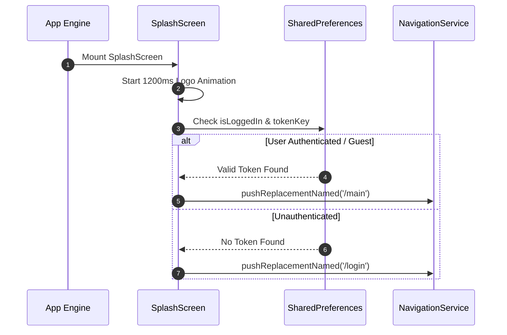

# Mobile Screen Deep-Dive: `SplashScreen`

> **File Path:** `apps/mobile/lib/features/splash/presentation/screens/splash_screen.dart`  
> **Route Name:** `'/'` (Initial Route)  
> **State Management:** Local Animation Controller & SharedPreferences  
> **Visual Style:** Cinema dark backdrop, animated glowing brand logo, pulse fade effect

---

## 1. Overview & Business Objectives

`SplashScreen` is the first screen rendered upon application startup. It serves as both a branded visual intro and an asynchronous routing dispatcher:
1. **Brand Animation:** Smooth scale-and-fade animation of the Ticketa cinema emblem.
2. **Session Verification:** Reads `AppConstants.tokenKey` and `AppConstants.isLoggedInKey` from `SharedPreferences`.
3. **Smart Dispatching:**
   - If an active session or valid token exists ➡️ Navigates directly to `MainPage` (`'/main'`).
   - If no token or user is logged out ➡️ Navigates to `LoginPage` (`'/login'`).

---

## 2. Lifecycle & Transition Flow

