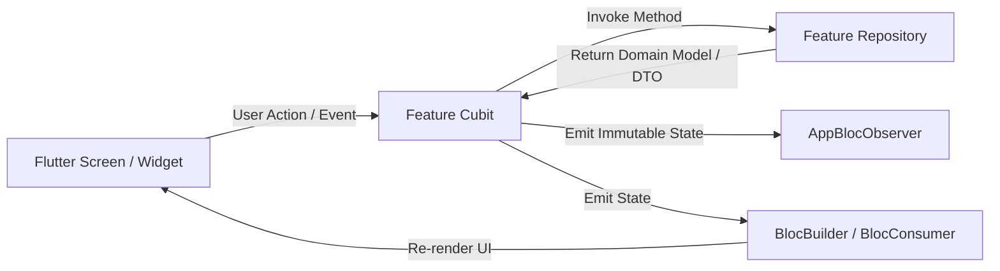
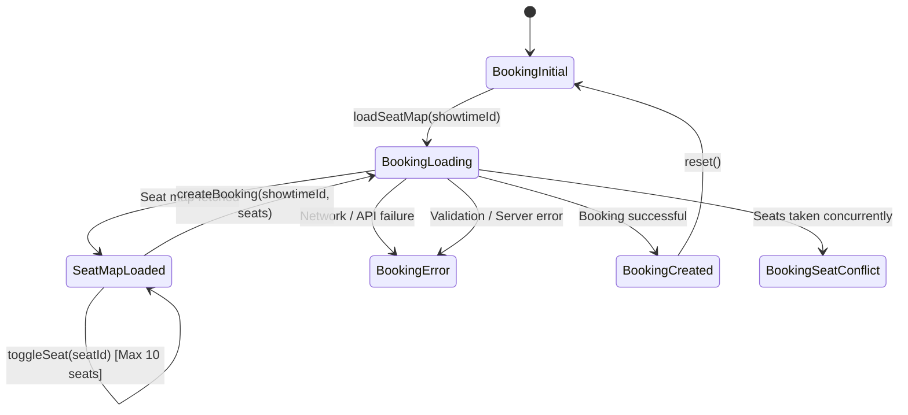
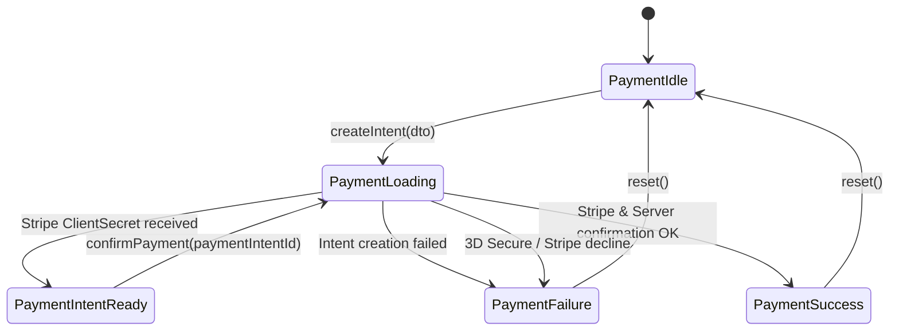

# Mobile State Management Architecture (BLoC / Cubit)

> **Key Package:** `flutter_bloc: ^8.1.6` & `provider: ^6.1.5+1`  
> **Global Observer:** `apps/mobile/lib/core/utils/app_bloc_observer.dart`

---

## 1. Architectural Overview

Ticketa mobile leverages the **Cubit** pattern (a lightweight BLoC implementation) for business logic and UI state control. Cubits provide:
1. **Predictable State Transitions:** States are immutable classes representing explicit UI conditions (`Initial`, `Loading`, `Loaded`, `Success`, `Error`).
2. **Unidirectional Data Flow:** Views invoke Cubit methods; Cubits execute repository logic and emit new states to consumers.
3. **Traceability:** All transitions and errors are intercepted globally by `AppBlocObserver`.



---

## 2. Complete Cubit Catalog

| Cubit Name | Location | Injected Dependency | Managed State Class |
| :--- | :--- | :--- | :--- |
| `HomeCubit` | `features/home/presentation/cubit/` | `MovieRepository` | `HomeState` (`HomeInitial`, `HomeLoading`, `HomeLoaded`, `HomeError`) |
| `MovieDetailCubit` | `features/home/presentation/cubit/` | `MovieRepository` | `MovieDetailState` (`MovieDetailInitial`, `MovieDetailLoading`, `MovieDetailLoaded`, `MovieDetailError`) |
| `NowShowingCubit` | `features/now_showing/presentation/cubit/` | `MovieRepository` | `NowShowingState` (`NowShowingInitial`, `NowShowingLoading`, `NowShowingLoaded`, `NowShowingError`) |
| `AuthCubit` | `features/auth/presentation/cubit/` | `AuthRepository` | `AuthState` (`AuthInitial`, `AuthLoading`, `AuthAuthenticated`, `AuthUnauthenticated`, `AuthError`, `AuthEmailUnconfirmed`) |
| `BookingCubit` | `features/booking/presentation/cubit/` | `BookingRepository` | `BookingState` (`BookingInitial`, `BookingLoading`, `SeatMapLoaded`, `BookingCreated`, `BookingSeatConflict`, `BookingError`) |
| `MyTicketsCubit` | `features/booking/presentation/cubit/` | `BookingRepository` | `MyTicketsState` (`MyTicketsInitial`, `MyTicketsLoading`, `MyTicketsLoaded`, `MyTicketsError`) |
| `PaymentCubit` | `features/payment/presentation/cubit/` | `PaymentRepository` | `PaymentState` (`PaymentIdle`, `PaymentLoading`, `PaymentIntentReady`, `PaymentSuccess`, `PaymentFailure`) |

---

## 3. Deep-Dive: Core Cubits

### 3.1 `BookingCubit` (`features/booking/presentation/cubit/booking_cubit.dart`)
Manages interactive cinema seat selection, concurrency locks, and booking submission.

#### State Machine


#### Key Capabilities
- **Local Seat Selection:** `toggleSeat(seatId)` allows selecting up to 10 seats concurrently without network roundtrips.
- **Seat Conflict Resolution:** Emits `BookingSeatConflict(conflictingSeatIds)` if another user reserves the seat during checkout.

---

### 3.2 `PaymentCubit` (`features/payment/presentation/cubit/payment_cubit.dart`)
Orchestrates the Stripe PaymentIntent lifecycle and payment confirmation.

#### State Machine


---

### 3.3 `HomeCubit` & `NowShowingCubit`
- **`HomeCubit`:** Orchestrates concurrent fetching of `nowShowing`, `upcoming`, and `topBooked` movies in parallel using `Future.wait`.
- **`NowShowingCubit`:** Manages paginated screening lists, genre categorization, and client-side title/genre filtering.

---

## 4. UI Consumption Patterns

### 4.1 `BlocConsumer` for State Rendering + Action Listening
Used when a screen needs both to redraw its interface on state changes and trigger side effects (e.g. snackbars or route transitions):

```dart
BlocConsumer<BookingCubit, BookingState>(
  listener: (context, state) {
    if (state is BookingSeatConflict) {
      MessageService.showError(
        context: context,
        message: 'Some of your selected seats are no longer available.',
      );
    } else if (state is BookingCreated) {
      Navigator.pushNamed(context, '/payment', arguments: state);
    }
  },
  builder: (context, state) {
    if (state is BookingLoading) return const CinemaSeatGridSkeleton();
    if (state is SeatMapLoaded) return CinemaSeatGrid(seatMap: state.seatMap);
    return const SizedBox.shrink();
  },
);
```

### 4.2 `AppBlocObserver` Observability
**File:** `apps/mobile/lib/core/utils/app_bloc_observer.dart`

Logs lifecycle changes to the debug console:
```dart
class AppBlocObserver extends BlocObserver {
  @override
  void onChange(BlocBase bloc, Change change) {
    super.onChange(bloc, change);
    AppLogger.d('${bloc.runtimeType} $change', tag: 'BLOC');
  }

  @override
  void onError(BlocBase bloc, Object error, StackTrace stackTrace) {
    AppLogger.e('${bloc.runtimeType} Error: $error', tag: 'BLOC', error: error);
    super.onError(bloc, error, stackTrace);
  }
}
```
